# Chassis Accessories
## Server Rails

### Hako-Core 
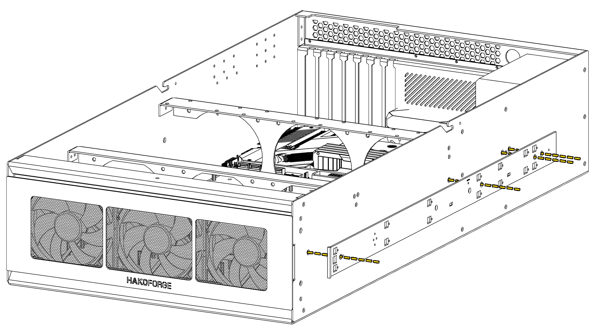

### Hako-Core Mini
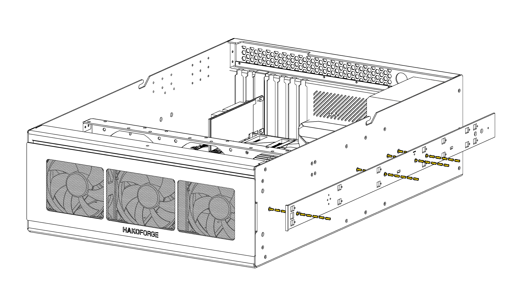

!!! info "Left and Right Rails"
    Take note of the ***L*** and ***R*** stickers on the rails and mount them on the correct side.
!!! warning "Inner Server Rail Mounting Holes"
    When installing the inner server rails, use the screw holes shown in the diagram. Not all holes in the server rail are used. 

## Server Rack Ears

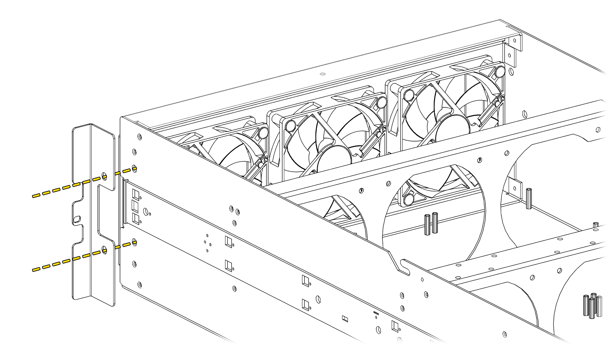

These metal flanges are used to secure the Hako-Core to a server rack's frame.

!!! info "Left and Right Server Rack Ears"
    Notice the rack frame holes are along the bottom part of the rack ears. Use this feature to distinguish between left and right rack ears.

!!! warning "Supporting The Chassis In A Server Rack"
    The rack ears alone are **not enough** to hold the chassis in a server rack. Server rails must be used. Rack ears are only to prevent the chassis from sliding out of the rack.

## Angled Fan Bracket

### Fan Installation

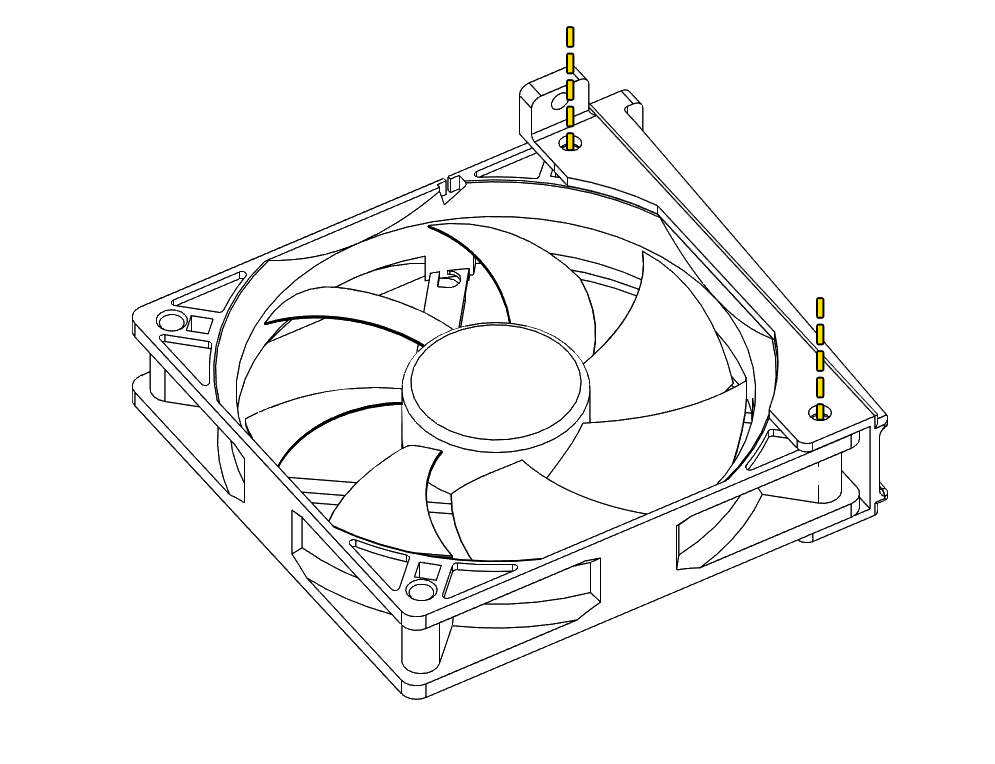

Use 2 of the mounting holes to secure a fan to the angled bracket.
!!! info "Direction of Air Flow"
    Take note of the fan mount direction to ensure proper air flow. Depending on the bracket orientation installed in the case, the fan may be flipped. 

### Overhang Mount
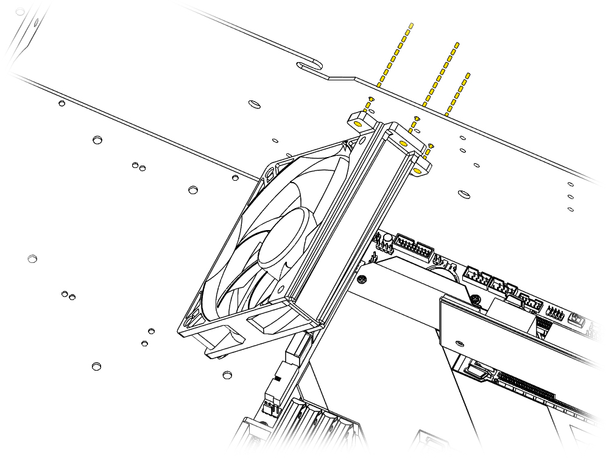
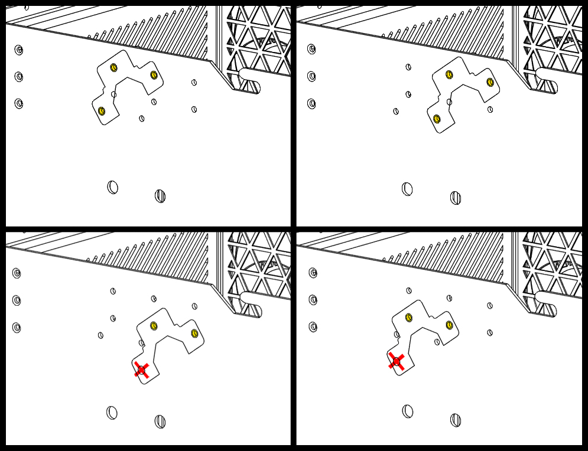
The mounting location can be moved left and right as well as up and down. 
!!! info "Lower Mount Point"
    When installing in the lowered position, one of the mount points will not be used. 

### Underhang Mount
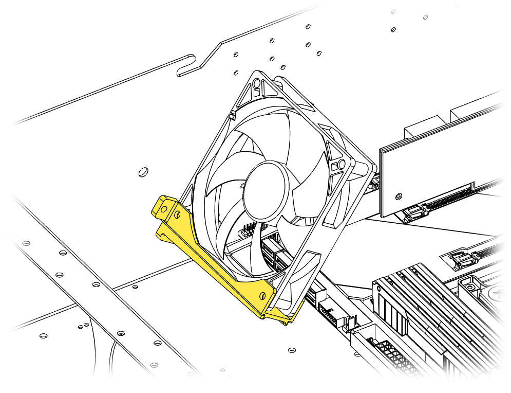
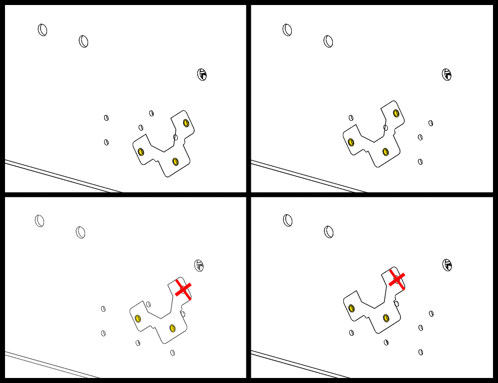
The angled fan bracket can also be under mounted. This can be useful depending on wire clearances with different HBA cards.

### Mount Extension
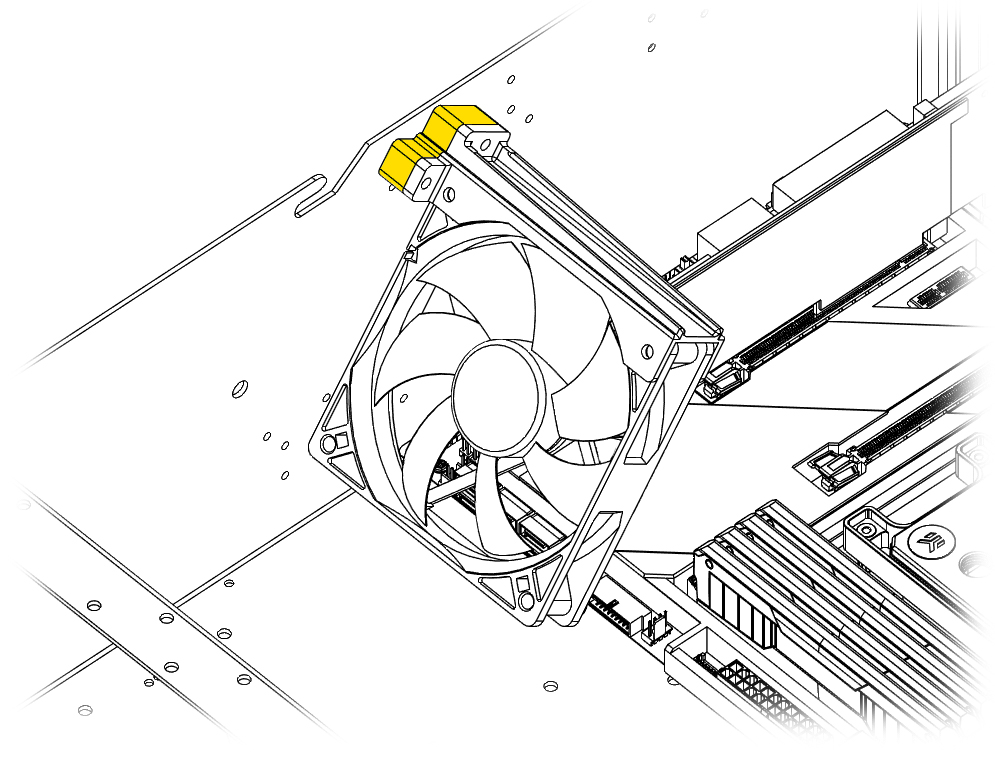
The included mount extensions can be used to extend the bracket out for extra coverage on the furthest PCIe card. Use the extended screws for this configuration.

## Horizontal Fan Bracket

### Fan Installation
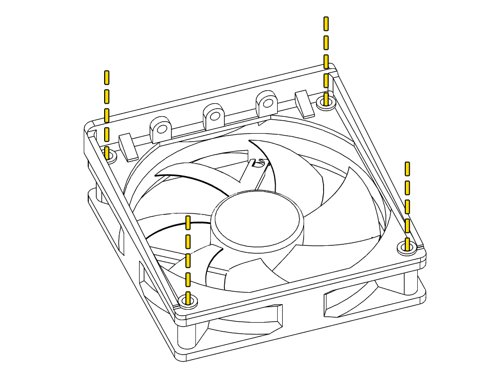

Use 4 of the mounting holes to secure a fan to the horizontal bracket.
!!! info "Direction of Air Flow"
    Take note of the fan mount direction to ensure proper air flow. Depending on the bracket orientation installed in the case, the fan may be flipped. 

### Overhang Mount
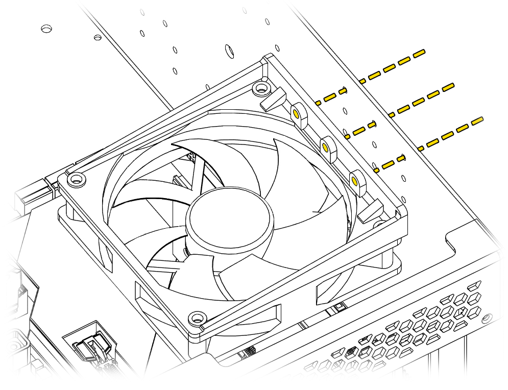
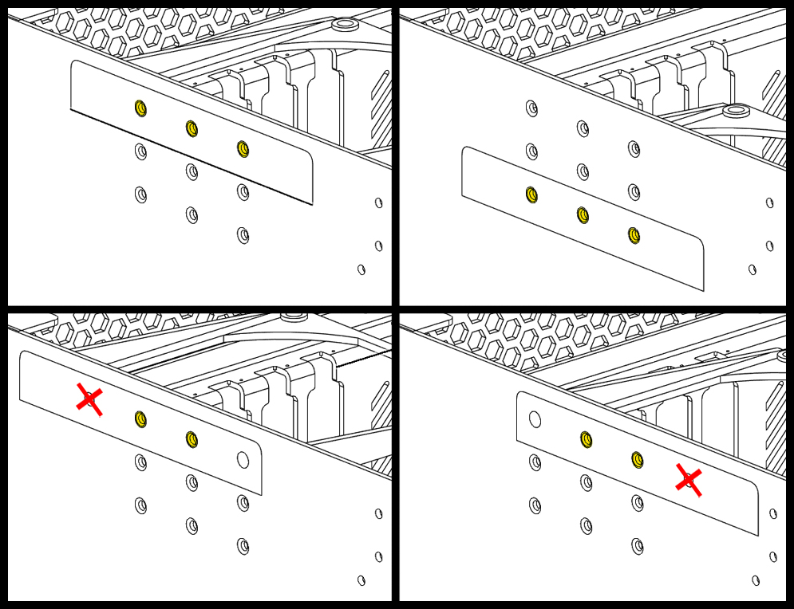
The mounting location can be moved left and right as well as up and down. 
!!! info "Left or Right Mount Points"
    When installing in the shifted left or right position, one of the mount points will not be used.