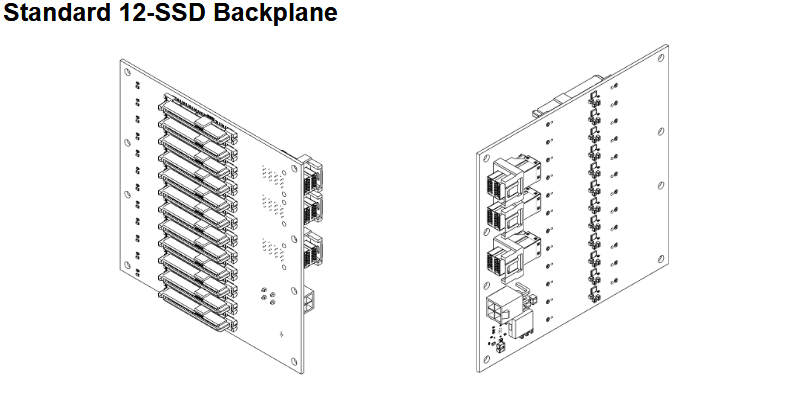
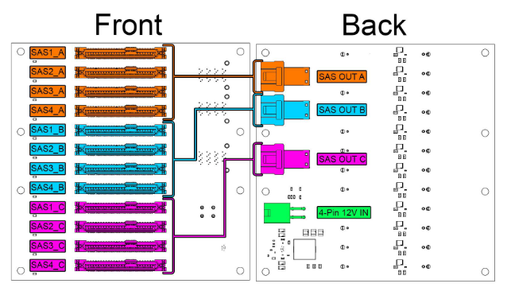

# 12-SSD Backplane

## Overview

The Standard 12-SSD Backplane provides high-density 2.5" drive storage with integrated power regulation and SAS/SATA connectivity for up to 12 solid-state drives or 2.5" hard drives.

This backplane is designed for maximum 2.5" drive density while providing clean power delivery and flexible connectivity options.

### Key Features

- 12 SATA/SAS 2.5" drive connectors for maximum storage density
- Integrated 5V power regulation from 12V input
- Triple SAS output connectors for flexible HBA connectivity
- Hot-swap capability with proper drive cages
- LED activity indicators for each drive bay

## Technical Specifications

| Parameter | Specification |
|-----------|---------------|
| **Drive Connectors** | 12 x SATA/SAS 2.5" |
| **SAS Outputs** | 3 SAS Out Connectors |
| **Input Voltage** | 12V DC |
| **Output Voltage** | 5V (25A Max) |
| **Max Power Consumption** | 84 Watts |
| **Hot-Swap** | Yes |

## Backplane Diagram

### Status Indicators

Each drive bay includes: 
- Power LED Green when drive is powered 
- Activity LED Flashing during I/O operations 
- Fault LED Red when drive error detected 

## Installation Guide

For PCB and Backplane Installation see [PCB Installation](../installation/pcb-installation.md) 
For Drive Cage Installation see [Cage Installation](../installation/cage-installation.md)

## Drive Installation

1. Insert drives gently into drive cages.
3. Gently press drive down until firmly seated.
4. Verify with LED indicators after system power-on.