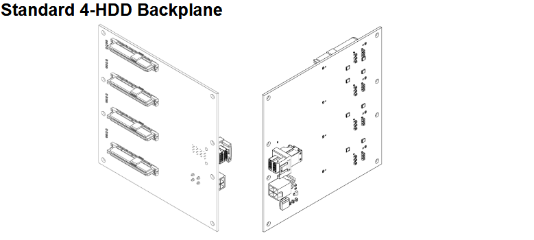
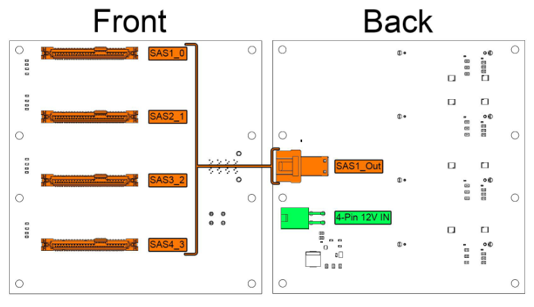

# 4-HDD Backplane

## Overview

The Standard 4-HDD Backplane provides power and data connectivity for up to four 3.5" hard disk drives or large-capacity SSDs, with integrated power regulation and SAS connectivity.

This backplane is optimized for traditional 3.5" hard disk drives, providing the higher power requirements and robust connectivity needed for spinning disk storage systems.

### Key Features

- 4 SATA/SAS 3.5" drive connectors for traditional hard drives
- Integrated 5V power regulation from 12V input
- Single SAS output connector for HBA connectivity
- Hot-swap capability with proper drive cages
- LED activity indicators for each drive bay

## Technical Specifications

| Parameter | Specification |
|-----------|---------------|
| **Drive Connectors** | 4 x SATA/SAS 3.5" |
| **SAS Output** | 1 SAS Out Connector  |
| **Input Voltage** | 12V DC |
| **Output Voltages** | 12V pass-through, 5V regulated (5A Max) |
| **Max Power Consumption** | 53 Watts |
| **Hot-Swap** | Yes |

## Backplane Diagram

### Status Indicators

Each drive bay includes: 
- Power LED Green when drive is powered 
- Activity LED Flashing during I/O operations 

!!! info "Power LED Compatibility"
    Some drives do not trigger the LEDs but are functioning correctly.

## Installation Guide

For PCB and Backplane Installation see [PCB Installation](../hardware/pcb-installation.md) 
For Drive Cage Installation see [Cage Installation](../hardware/cage-installation.md)

## Drive Installation

1. Insert drives gently into drive cages.
3. Gently press drive down until firmly seated.
4. Verify with LED indicators after system power-on.