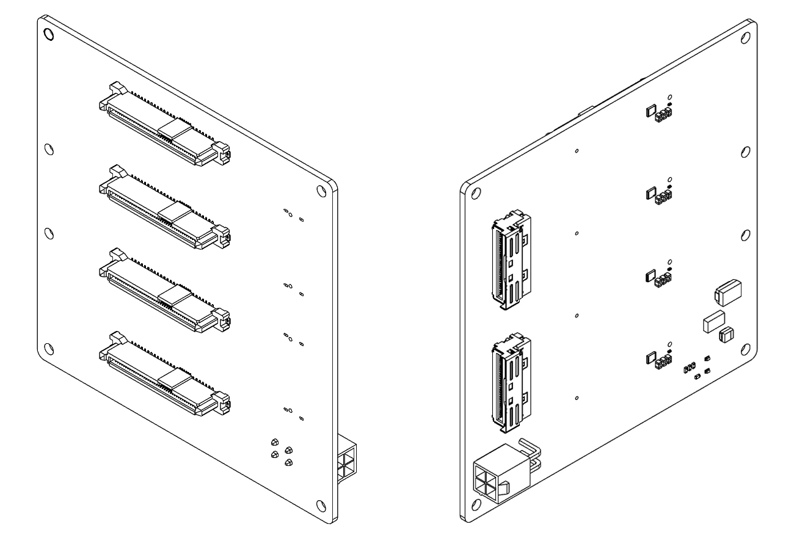
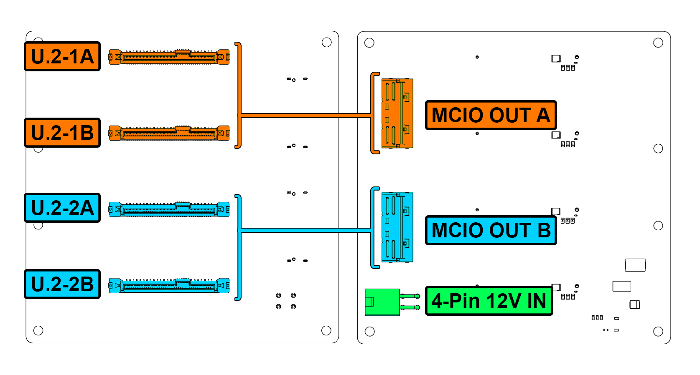

# 4-U.2 Backplane

{: style="width: 600px;"}

## Overview

The Standard 4-U.2 Backplane provides high-density 2.5" drive storage with integrated power regulation and SAS/SATA connectivity for up to 4 U.2 15mm drives.

### Key Features

- 4 U.2 2.5" drive
- Integrated 3.3V power regulation from 12V input
- Dual MCIO output connectors 

## Technical Specifications

| Parameter | Specification |
|-----------|---------------|
| **Drive Connectors** | 4 x U.2 2.5" 15mm |
| **SAS Outputs** | 2 MCIO Out Connectors |
| **Input Voltage** | 12V DC |
| **Output Voltage** | 12V pass-through, 3.3V regulated |
| **Max Power Consumption** | 100 Watts |
| **Hot-Swap** | No |

## Backplane Diagram

### Status Indicators

Each backplane includes an LED on the back to indicate proper power delivery.

## Installation Guide

For PCB and Backplane Installation see [PCB Installation](../hardware/pcb-installation.md) 
For Drive Cage Installation see [Cage Installation](../hardware/cage-installation.md)

## Drive Installation

1. Insert drives gently into drive cages.
3. Gently press drive down until firmly seated.
4. Verify with LED indicators after system power-on.