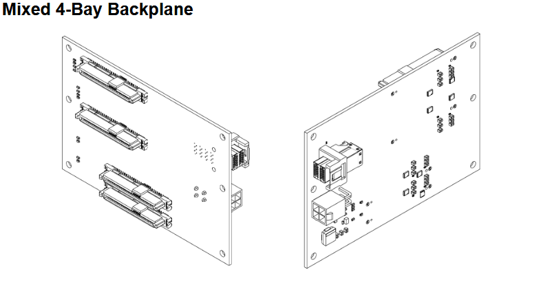
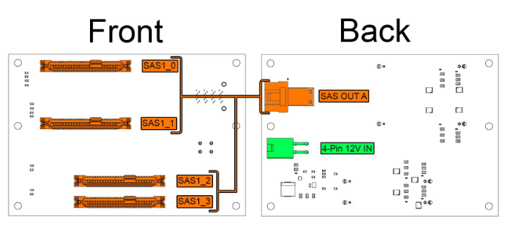

# Mixed 4-Bay Backplane

## Overview

The Mixed 4-Bay Backplane provides the flexibility of both 2.5" and 3.5" drive support in a single PCB, ideal for hybrid storage configurations combining SSDs and traditional hard drives.

This backplane combines the best of both storage worlds, allowing users to optimize for both performance (SSD) and capacity (HDD) within the same chassis row.

### Key Features

- Hybrid connectivity 2x 2.5" SSD + 2x 3.5" HDD connectors
- Unified power management for both drive types

## Technical Specifications

| Parameter | Specification |
|-----------|---------------|
| **2.5" Connectors** | 2 x SATA/SAS 2.5" |
| **3.5" Connectors** | 2 x SATA/SAS 3.5" |
| **SAS Output** | 1 SAS Out Connector |
| **Input Voltage** | 12V DC |
| **Output Voltages** | 12V pass-through, 5V regulated (5A Max) |
| **Max Power Consumption** | 40 Watts |
| **Hot-Swap** | Yes |

## Backplane Diagram

### Status Indicators

Each drive bay includes: 
- Power LED Green when drive is powered 
- Activity LED Flashing during I/O operations 
- Fault LED Red when drive error detected 

## Installation Guide

For PCB and Backplane Installation see [PCB Installation](../installation/pcb-installation.md) 
For Drive Cage Installation see [Cage Installation](../installation/cage-installation.md)

## Drive Installation

1. Insert drives gently into drive cages.
3. Gently press drive down until firmly seated.
4. Verify with LED indicators after system power-on.