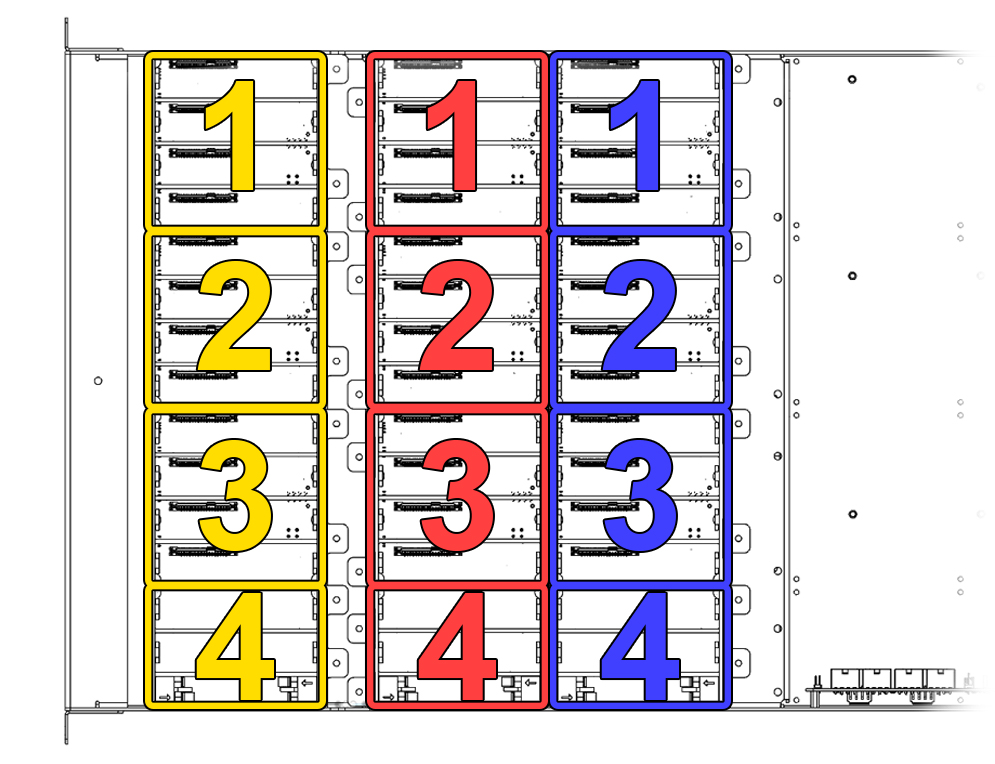

# Component Installation
## Motherboard

The Hako-Core supports anything from a Mini-ITX up to an E-ATX.
### Hako-Core Mini With E-ATX

The Hako-Core Mini when using an E-ATX motherboard limits the second row of backplane to only the small backplane

## Power Supply

Use the respective mounts for your specific power supply. The Hako-Core supports up to 200mm power supply.

## Mini-SAS Zip Tie Colors

The Mini-SAS cables have zip ties on them.  
Each color represents the row of backplanes it is connected to.  
The number of zip ties represent which backplane in that row it is connected to.

- Row 1: Yellow
- Row 2: Red
- Row 3: Blue