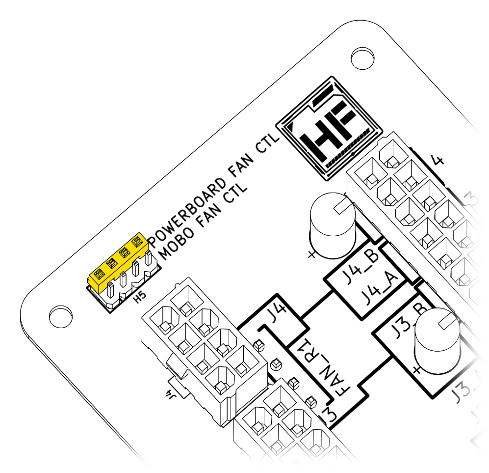

# Powerboard Connections
## Fan Control Jumper
### MOBO FAN CTL Position

{: style="width: 400px;"}

{: style="width: 400px;"}

With the jumper in this position, all fan headers will be controlled by the ***PWM_IN*** connector. This can be connected to a header on your motherboard or a dedicated fan controller. The USB connection is not required.

### POWERBOARD FAN CTL Position

{: style="width: 400px;"}

{: style="width: 400px;"}

With the jumper in this position, all fan headers will be controlled by the powerboard. A USB connection is required. With the Hako Foundry software, you're able to control each fan wall individually. 

## 8-pin PCIe Connectors

{: style="width: 400px; height: auto;"}

Each 8-Pin PCIe connector powers a specific set of hardware. If there is a set of hardware that is not being used in your configuration, connection is optional. 
### 8-Pin PCIe IN 1
- Row 1* Backplane 4
- Row 1* Backplane 3
- Fan wall 1

### 8-Pin PCIe IN 2
- Row 1* Backplane 2
- Row 1* Backplane 1

### 8-Pin PCIe IN 3
- Row 2* Backplane 4
- Row 2* Backplane 3
- Fan wall 2

### 8-Pin PCIe IN 4
- Row 2* Backplane 2
- Row 2* Backplane 1
- Fan wall 3**

!!! note "Dual Powerboard Hako-Core Configuration"
    \* ***Row 1*** and ***Row 2*** connections on the second powerboard are connected to ***Row 3*** and ***Row 4***   
    ** The exposed ***Fan Wall 3*** headers can be used for other fans if there is no fan wall 3 in your configuration
    
## Mini-B USB to USB 2.0 Header

The Powerboard comes with a Mini-B USB to USB 2.0 Header that will connect to a USB 2.0 Header on your motherboard. This connection is required for individual fan wall control and power monitoring of drives. If these features are not used, the USB connection is optional. 

!!! warning "USB 2.0 Header Connector Orientation"
    Take note of the empty pin on the connector and align them with the motherboard properly. Improper connection may cause damage to components.

## PWM_IN to Fan Header

The Powerboard comes with a PWM_IN to USB 2.0 Header that will connect to a fan header on your motherboard. The connected motherboard fan header will control all fans connected to the powerboard. If fan control is not desired, leaving this unplugged will have the fans run at full speed.

!!! note "PWM_IN and USB connected"
    Having both the ***PWM_IN*** and ***USB*** wires connected to the motherboard is OK. This configuration will allow you to switch between fan controls with the jumper.