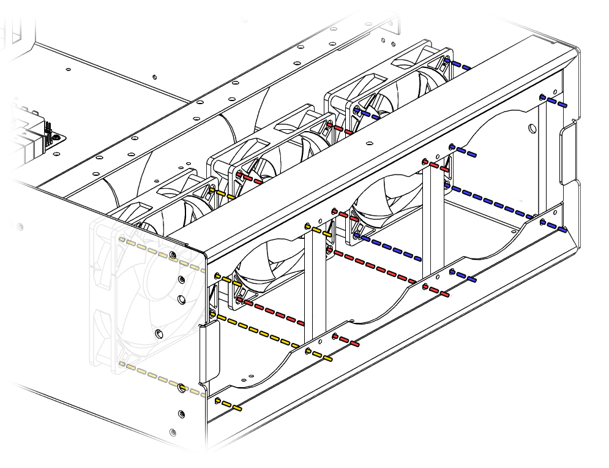
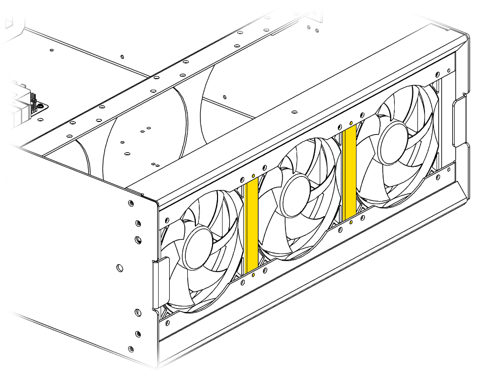
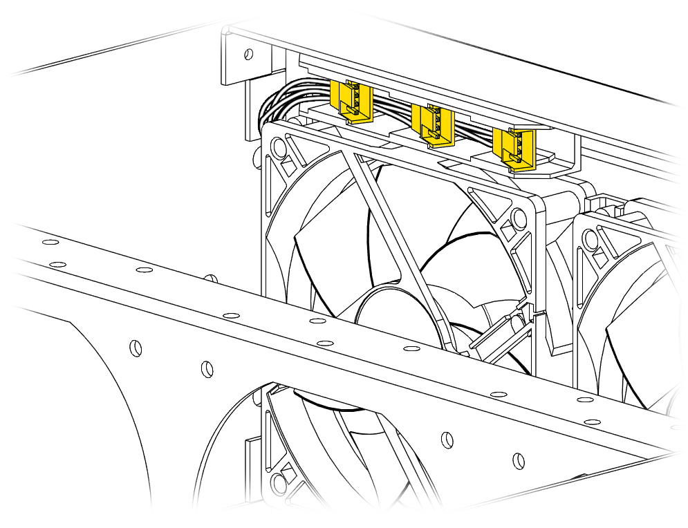
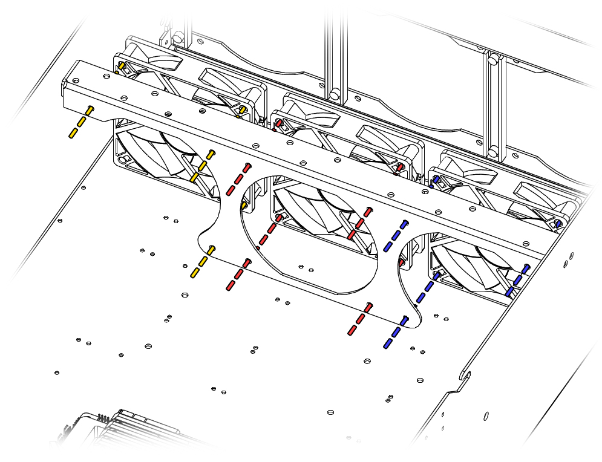
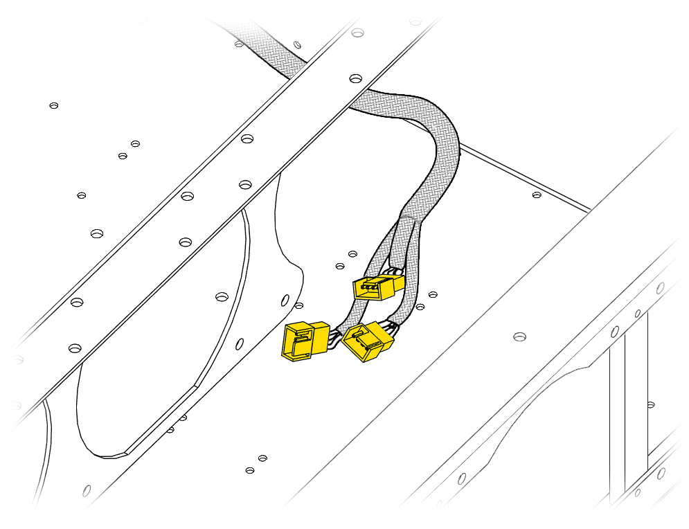
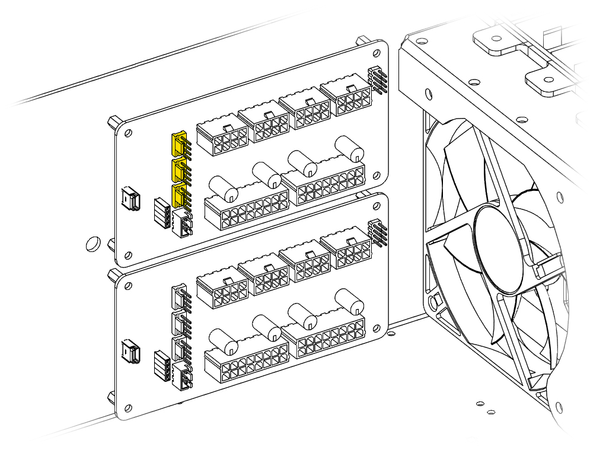
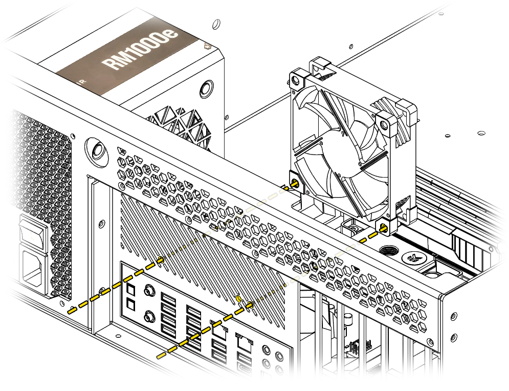

# Chassis Fans
!!! warning "Fan Thickness Compatibility"
    Only ***Fan Wall 1*** and ***Fan wall 3*** are capable of **35mm** thickness fans. ***Fan Wall 2*** is only able to fit **25mm** thickness fans.
!!! info "Fan Wall Compatibility"
    All fan walls use **120mm** fans.
## Fan Wall 1

Remove the magnetic faceplate and install the fans using the mounting holes.

!!! info "Air Block Clearance"
    The 3D printed air blocks may be too tight for fan installation. Unscrew these and reinstall them **along** with the fan at the same time to get them to fit together. 
### Fan Headers

The fan headers for ***Fan Wall 1*** are located above the the left fan and connect to the powerboard. Plug the fans in here and tuck the wires in between the fans. 

## Fan Wall 2/3

!!! tip "Middle Fan Headers"
    ***Fan Wall 2*** uses fan extension cable to connect to the powerboard. Plugging the fans in first and tucking the wires under the fan makes the install easier. 
Install the fans using the mounting holes. Fan wall 2 and 3 use similar mounting points. The fourth screw on the edge fans are not used.
### Fan Extension

This cable is used for ***Fan Wall 2***.
### Exposed Powerboard Headers

***Fan Wall 3*** uses the exposed fan headers on the powerboard.
!!! info "Hako-Core Mini Fan Walls"
    The Hako-Core Mini does not utilize a third fan wall so the exposed headers can be used for any other fans you may have.
## Exhaust Fan

Use the 2 mount points to install a 80 mm or 92 mm fan to help facilitate airflow. 
## Accessory Fans
See [Accessory Fan Bracket Mounts](accessories.md#angled-fan-bracket) to get instructions on the accessory bracket installation.