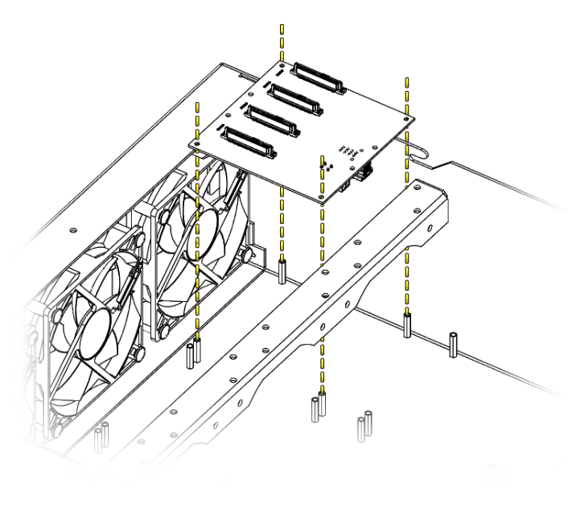

# PCB Installation

## Overview
This guide covers the proper mounting procedures for all backplane types and ensures secure connections.

Each PCB in the Hako-Core system provides power regulation and data connectivity for a specific set of drives. Proper installation ensures optimal performance and system reliability.

## PCB Types

The Hako-Core and Hako-Core Mini supports several PCB configurations:
###Standard Size Backplanes
- **4-HDD Backplane**: 3.5" drive support  
- **12-SSD Backplane**: 2.5" drive support
- **4-U.2 Backplane**: 2.5" drive support
###Small Size Backplanes
- **Mixed 4-Bay Backplane**: Combined 2.5" and 3.5" support

!!! danger "Safety First"
    It is always recommended to power down the system when working inside the case.

## Removal Procedure

The removal procdure is the same for all 4 variants of backplanes sold by HakoForge

Power off the machine.

1. Unscrew the 4 black hex head bolts securing the PCB to the standoffs
2. Lift the PCB and detach the data and power cables
3. Remove the PCB from the case.

<iframe width="560" height="315" src="https://www.youtube.com/embed/ZzINWt7IFxE" title="YouTube video player" frameborder="0" allow="accelerometer; autoplay; clipboard-write; encrypted-media; gyroscope; picture-in-picture; web-share" referrerpolicy="strict-origin-when-cross-origin" allowfullscreen></iframe>

## Installation Procedure

!!! danger "Safety First"
    It is always recommended to power down the system when working inside the case.

### Identify Mounting Location

Each PCB has designated mounting locations within the chassis:

Power off the machine.

1. Locate standoffs in chassis for your PCB position
2. Connect the data and power connecter to the PCB
3. Align PCB over the mounting standoffs 

    (Note: if you are replacing an existing PCB and the fans and neighboring PCBs are already installed connect the power and data cables before screwing the PCB into the standoffs.(Shown in video below))

4. Verify all mounting holes align with standoffs
5. Secure PCB with provided hex screws. (Recommended to start opposite corners first, do not overtighten.)

!!! warning "Torque Specification"
    Be aware of cross threading when first turning the screw.  
    Do not over-tighten screws. PCBs can crack under excessive pressure.  
    Tighten just until snug with no movement.

<iframe width="560" height="315" src="https://www.youtube.com/embed/lgaEEVNXSJE" title="YouTube video player" frameborder="0" allow="accelerometer; autoplay; clipboard-write; encrypted-media; gyroscope; picture-in-picture; web-share" referrerpolicy="strict-origin-when-cross-origin" allowfullscreen></iframe>

## Verification Steps

### Visual Inspection

After installation, verify:

- PCB sits level and secure
- All screws properly tightened
- No visible cable stress or interference
- Any connectors are fully seated

### Electrical Testing

Before installing drives:

1. Power on system (without drives)
2. Check PCB power LEDs if present
4. Test with single drive before full installation