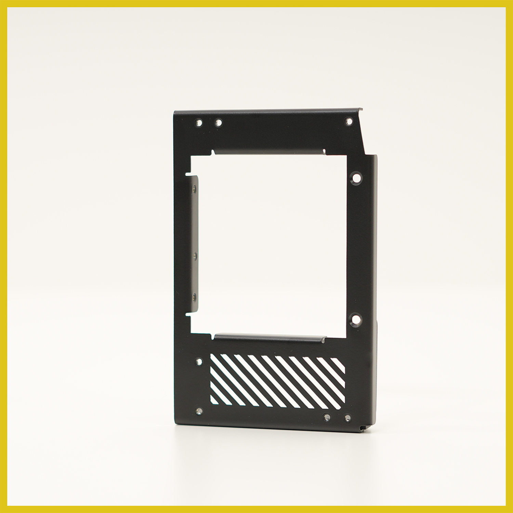
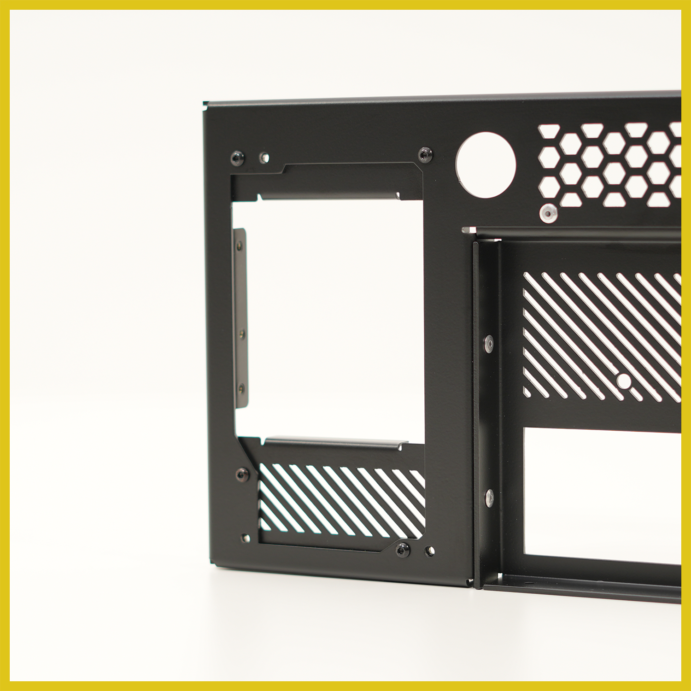
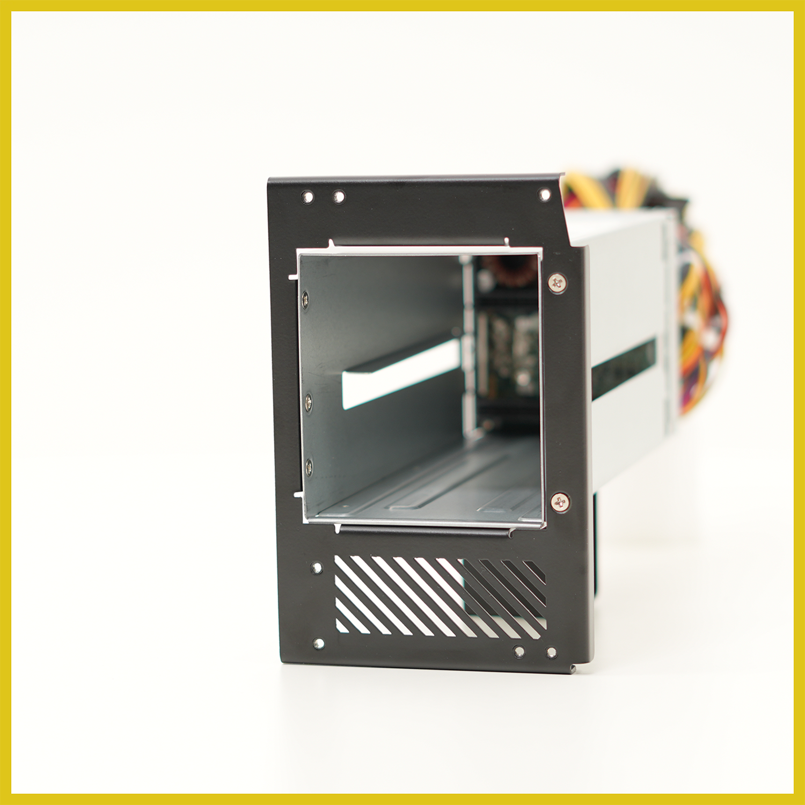
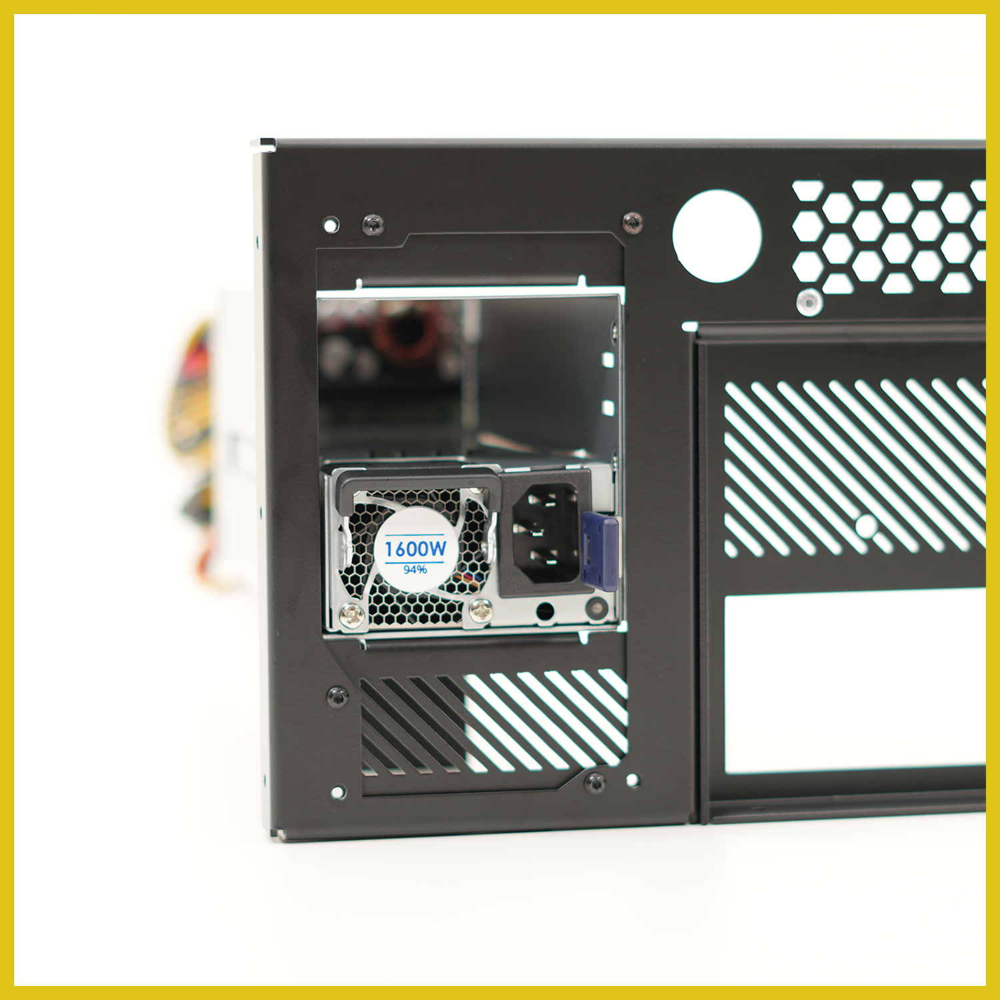
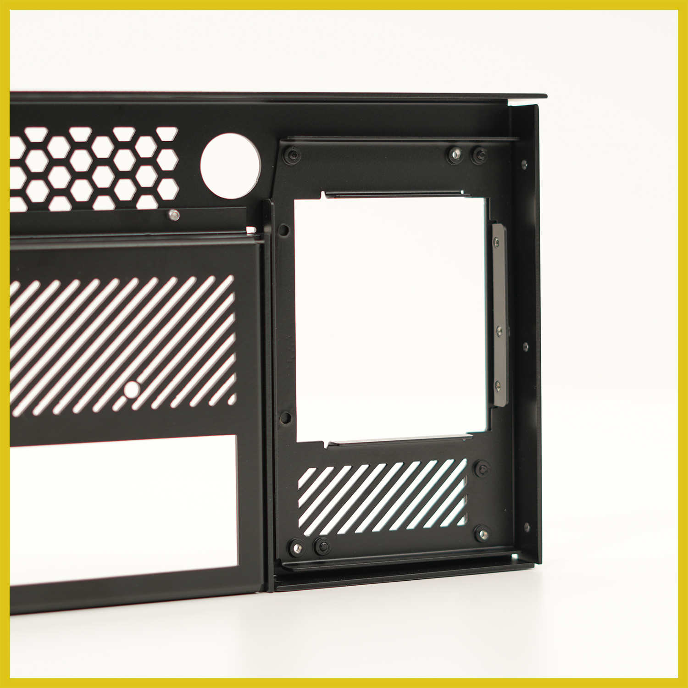
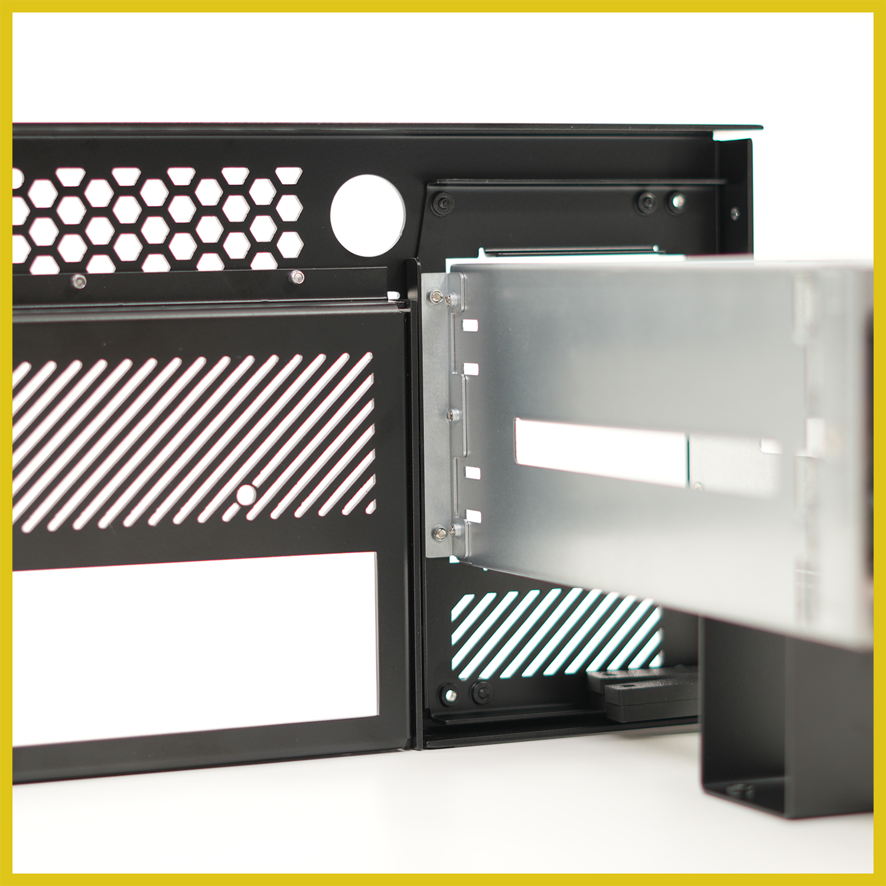

# HakoForge CRPS PSU Adapter

*Swap ATX for server-grade power.*

This PSU Adapter replaces the stock ATX power supply mount on your HakoForge chassis, opening the bay up to CRPS server power supplies. Get the density, efficiency, and hot-swap serviceability of enterprise hardware in the same footprint — no chassis modification required, simply attach the adapter with the provided hardware.

{: style="max-width: 700px; width: 100%;"}

## Features

- **Fits the whole HakoForge lineup** — one adapter, designed around the shared PSU mounting pattern used across our chassis.
- **Direct bolt-on installation** — mounts to existing chassis hardpoints using the supplied fasteners. No drilling, no cutting, no permanent changes.
- **Precision-formed steel construction** — laser-cut and CNC-brake-formed from sheet steel, finished in matte black powder coat to match your case.
- **Integrated ventilation** — angled slot arrays above and below the PSU opening keep intake and exhaust paths clear and preserve chassis airflow.
- **Rear-accessible service** — the PSU module and its inlet sit flush with the rear panel, so the power supply can be released and swapped without opening the case.
- **Reversible** — remove the adapter and reinstall the standard ATX mount at any time.

## Compatibility

- All HakoForge chassis
- CRPS server power supplies
- FSP (550W-20fm, 800W-20fm, 1200W-20fm, 1600W-20fm, 2000W-20fm, 2400W-20fm)

## In the Box

- PSU Adapter bracket
- PSU Enclosure
- Stand
- Mounting hardware kit

!!! note "Power Supply Not Included"
    This is only the enclosure and mounting system. The power supply is not included.

## Installation

!!! danger "Safety First"
    It is always recommended to power down the system and disconnect it before working inside the case.

Mountint hardware is all provided with kit.

1. Remove the existing ATX power supply mount from the chassis.
2. Attach the CRPS enclouse to the Adapter Bracket
3. Attach the enclosure stand onto the enclosure
4. Secure the adapter bracket to the rear of the chassis.
5. Side the CRPS PSU module into the enclosure and secure it inplace.
