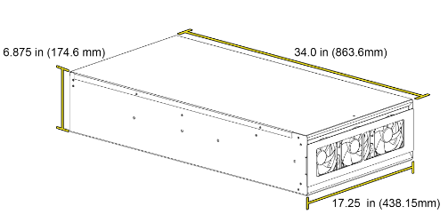
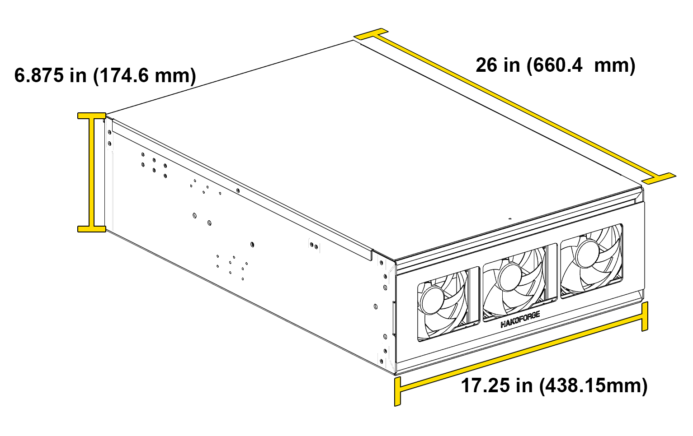

# Dimensions and Specifications

## Hako-Core Specifications

### Physical Dimensions

| Dimension | Measurement |
|-----------|-------------|
| **Length** | 34.0 in (863.6mm) |
| **Width** | 17.25 in (438.15mm) |
| **Height** | 6.875 in (174.6mm) |

### Weight Specifications

| Configuration | Weight |
|---------------|--------|
| **Minimal Setup** | 20 lbs |
| *3 fans, 3 cages & PCBs, no drives* | |
| **Standard Setup** | 25 lbs |
| *3 fans, 9 cages & PCBs, no drives* | |
| **Fully Loaded** | ~35 to ~90 lbs |
| *3 fans, 9 cages & PCBs, 42 HDD, 6 SSD* | *(depending on drives used)* |

### Drive Power Capability

The Hako-Core includes 2 powerboards, making it capable of powering drives up to **1,200 Watts** (150 watts maximum per PCIe connector).

### Drive Capacity

The Hako-Core uses a modular backplane system. It has **3 rows**, and each row has **3 full-size backplane spots** plus **1 smaller hybrid spot**. The full-size backplanes can be mixed and matched across the spots to suit your storage needs.

| Backplane | Capacity |
|-----------|----------|
| **HDD** | 4 &times; 3.5" HDD |
| **SSD** | 12 &times; 2.5" SSD |
| **U.2** | 4 &times; U.2 |
| **Hybrid** (small spot) | 2 &times; HDD + 2 &times; SSD, or 4 &times; SSD |

A configuration's total capacity is the sum of the backplanes installed. For example, an all-SSD build fills all 9 full-size spots with SSD backplanes (9 &times; 12 = 108) and all 3 hybrid spots with hybrid backplanes in 4-SSD mode (3 &times; 4 = 12), for a maximum of **120 SSDs**.

!!! info "JBOD Configuration"
    Run as a JBOD (without a motherboard), the Hako-Core frees up the motherboard area for an additional row of backplanes.

### Motherboard Support

The Hako-Core supports a wide range of motherboard form factors:

- **Mini-ITX**
- **Mini-DTX**
- **FlexATX**
- **Micro ATX**
- **ATX**
- **E-ATX**
- **XL-ATX**
- **SSI-CEB**
- **SSI-EEB**

### Component Clearance

| Clearance | Measurement |
|-----------|-------------|
| **GPU** | Length: 366mm, Height: 154mm |
| **CPU Cooler** | ~150mm &plusmn;5mm, depending on motherboard |

### Fan Support
!!! warning "Fan Thickness Compatibility"
    Only ***Fan Wall 1*** and ***Fan wall 3*** are capable of **35mm** thickness fans. ***Fan Wall 2*** is only able to fit **25mm** thickness fans.
- Hako-Core supports up to **3 fan walls totaling 9 fans total** (120mm)
- 1 Exhaust fan (80mm or 92mm)
- Auxiliary fans for PCIe cooling

### Power Supply Support

- **Form Factor**: ATX, SFX with adapter, or CRPS with our [PSU Adapter](psu-adapter.md)
- **Maximum Length**: 200mm
- **Recommended PSU**: Corsair HX1500i
- **Connector Requirements**: Standard ATX power connectors

### Airflow Design

- **Front-to-rear** airflow pattern
- **Positive pressure** configuration recommended
- **Variable speed control** through motherboard or fan controller

### Materials

- **Construction**: Powder coated aluminum
- **Lid**: 18 gauge steel
- **Finish**: Durable powder coating for long-lasting protection
- **Mounting**: Standard rack-mountable 4U form factor

### Hot-Swap Support

- All drive bays support hot-swappable operation **excluding U.2 backplane**
- SAS/SATA compatibility across all bays
- Individual drive power and data connectivity

## Hako-Core Mini Specifications

### Physical Dimensions

| Dimension | Measurement |
|-----------|-------------|
| **Length** | 26.0 in (660.4mm) |
| **Width** | 17.25 in (438.15mm) |
| **Height** | 6.875 in (174.6mm) |

### Weight Specifications

| Configuration | Weight |
|---------------|--------|
| **Minimal Setup** | 15 lbs |
| *3 fans, 3 cages & PCBs, no drives* | |
| **Standard Setup** | 20 lbs |
| *3 fans, 6 standard cages + 2 mini cages & PCBs, no drives* | |
| **Fully Loaded** | ~35 to ~75 lbs |
| *3 fans, 6 standard cages + 2 mini cages & PCBs, 28 HDD, 6 SSD* | *(depending on drives used)* |

### Power Capability

The Hako-Core Mini includes 1 powerboard, making it capable of powering drives up to **600 Watts** (150 watts maximum per PCIe connector).

### Drive Capacity

The Hako-Core Mini uses the same modular backplane system as the Hako-Core, but with **2 rows** instead of 3. Each row has **3 full-size backplane spots** plus **1 smaller hybrid spot**, for up to **6 full-size backplanes and 2 hybrid backplanes**. The per-backplane capacities are the same as the Hako-Core (see the table above).

For example, an all-SSD Mini build fills all 6 full-size spots with SSD backplanes (6 &times; 12 = 72) and both hybrid spots in 4-SSD mode (2 &times; 4 = 8), for a maximum of **80 SSDs**.

### Motherboard Support

The Hako-Core Mini supports the same range of motherboard form factors as the Hako-Core:

- **Mini-ITX**
- **Mini-DTX**
- **FlexATX**
- **Micro ATX**
- **ATX**
- **E-ATX**
- **XL-ATX**
- **SSI-CEB**
- **SSI-EEB**

!!! info "E-ATX and Larger Boards"
    When using an E-ATX (or larger) motherboard, the second row of backplanes is limited to the small backplane only. See [Component Installation](components.md#hako-core-mini-with-e-atx).

### Component Clearance

| Clearance | Measurement |
|-----------|-------------|
| **GPU** | Length: 377mm (320mm with a second row of cages), Height: 154mm |
| **CPU Cooler** | ~150mm &plusmn;5mm, depending on motherboard |

### Fan Support

- Hako-Core Mini supports up to **2 fan walls totaling 6 fans total** (120mm)
- 1 Exhaust fan (80mm or 92mm)
- Auxiliary fans for PCIe cooling

### Power Supply Support

- **Form Factor**: ATX, SFX with adapter, or CRPS with our [PSU Adapter](psu-adapter.md)
- **Maximum Length**: 200mm
- **Recommended PSU**: Corsair HX1000i
- **Connector Requirements**: Standard ATX power connectors

### Airflow Design

- **Front-to-rear** airflow pattern
- **Positive pressure** configuration recommended
- **Variable speed control** through motherboard or fan controller

### Materials

- **Construction**: Powder coated aluminum
- **Lid**: 18 gauge steel
- **Finish**: Durable powder coating for long-lasting protection
- **Mounting**: Standard rack-mountable 4U form factor

### Hot-Swap Support

- All drive bays support hot-swappable operation **excluding U.2 backplane**
- SAS/SATA compatibility across all bays
- Individual drive power and data connectivity