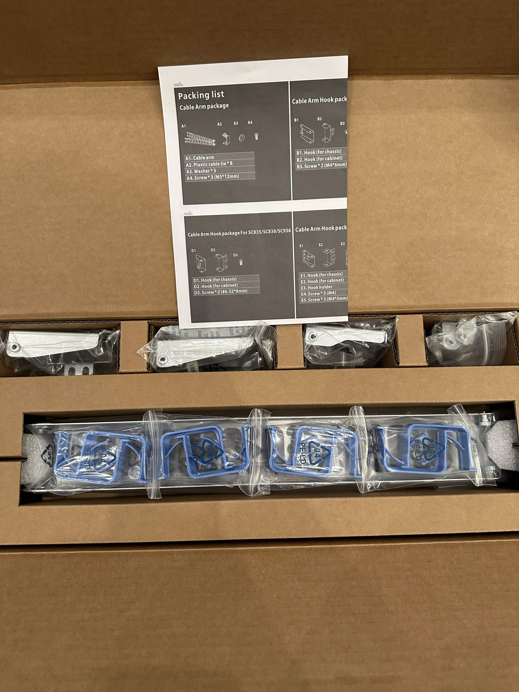
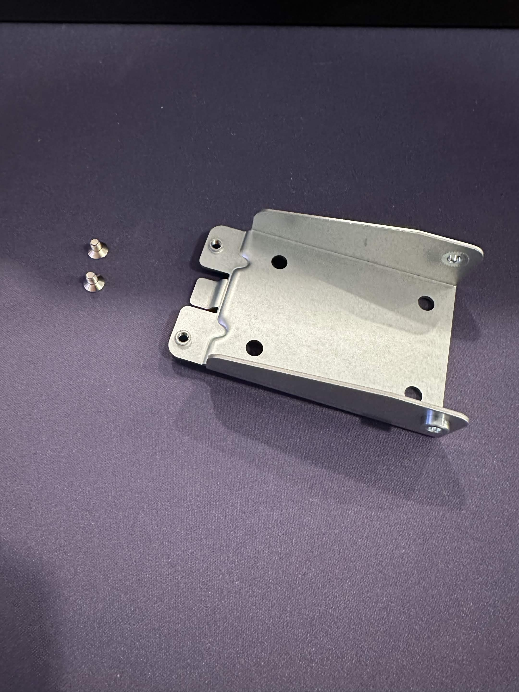
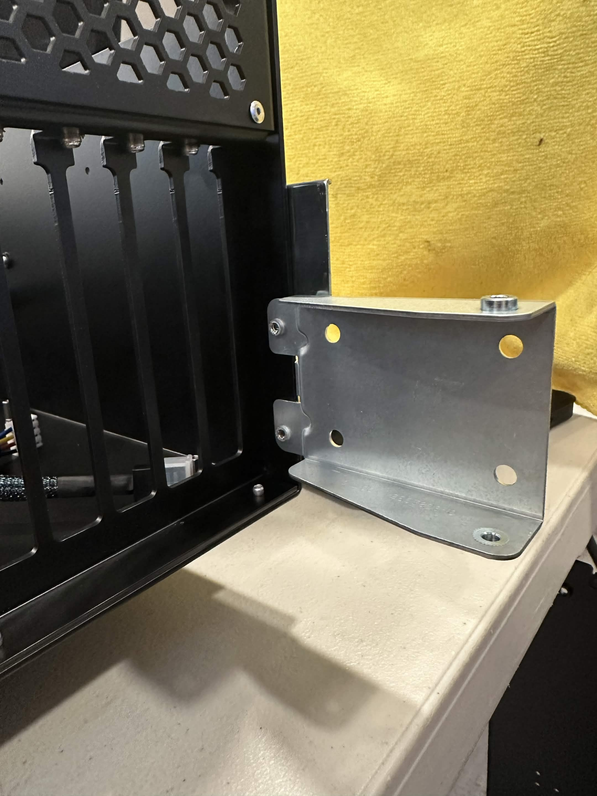
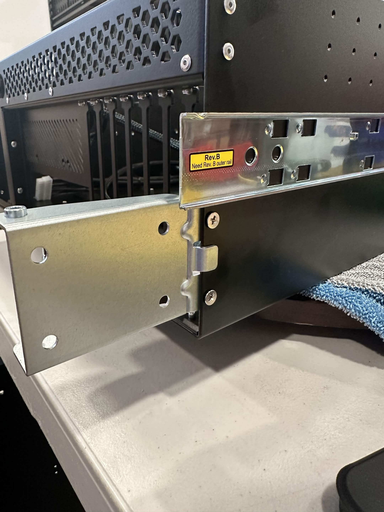
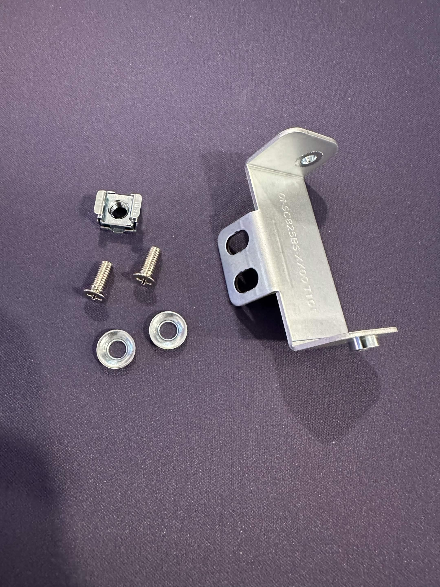
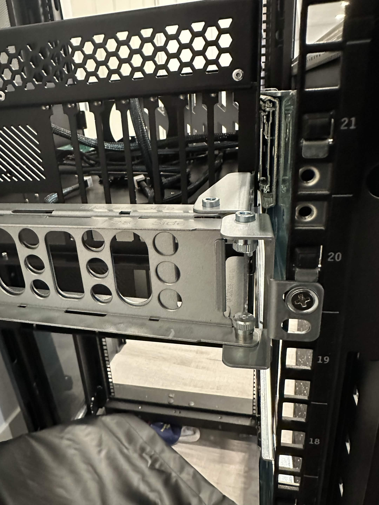
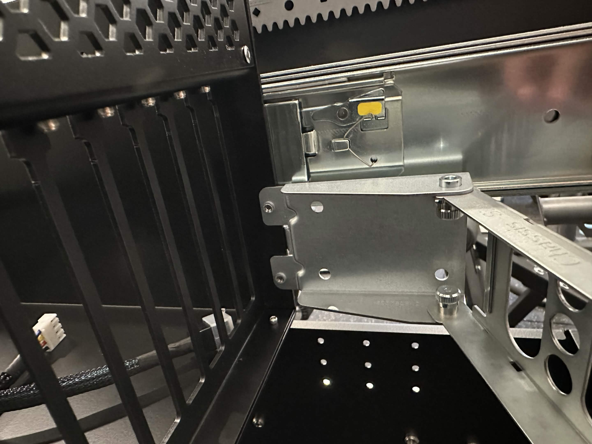

# Cable Management Arm Installation

## Overview
The Hakoforge line of cases support the installation of a Cable Management arm. 
To use the management arm, you will need to have a rack that is roughly 6" inches deeper than the case you are using.

For example, the Core 34", you will need a rack that is deeper than 40" inches or the use of an rack depth extension.

### Part Number

**MCP-290-00073-0N**

## Installation Procedure

Parts

### **Installing the Case Brackets**
**Case Bracket** - this part will be attached to the case.

!!! info "Alignment"
    Because of tolerances between bracket and case, you might have to barely thread both screws first before fully tightening.

1. Align the screw holes to the mounting holes at the rear of the Case
2. Using the 2 short screws, attach the bracket to the case.

### **Installing the Rack Brackets**
**Rack Bracket** - this part will be attached to the rack/rail.

!!! info "Stability"
    Optionally, if you want more stablilty a M5 cage nut can be installed directly below the bottom most rail threaded hole.

1. Align the top screw hole on the bracket to the bottom most hole on the rail.
2. Using the short screws and a washer, attach the bracket to the rail as shown on the image..

### **Installing the Arm**
**Arm** - this part will be attached to the 2 brackets. Case Bracket and Rack Bracket.

1. Align the side that says "Chassis side" with the case, and pulled on both alignment pins on the arm to retract them and allow for them to go into the bracket.
2. Do the same on the opposite end of the arm.

