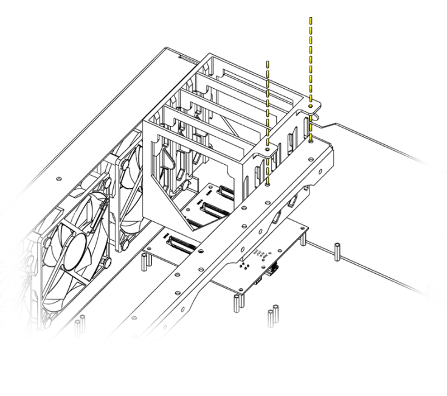

# Cage Installation

## Overview
Drive cages provide the mechanical interface between storage devices and the Hako-Core chassis. They enable hot-swappable operation and ensure proper alignment with PCB connectors.

The Hako-Core supports multiple cage types to accommodate different storage configurations. Each cage is designed for specific drive formats and mounting requirements.

### Cage Types

| Cage Type | Drive Format | Capacity | Hot-Swap |
|-----------|--------------|----------|----------|
| **12-SSD Cage** | 2.5" SSD | 12 drives | Yes |
| **4-HDD Cage** | 3.5" HDD | 4 drives | Yes |
| **Mixed Cage** | 2.5" + 3.5" | 2+2 drives | Yes |

### Key Features

- Tool-free installation using thumb screws
- Keyed alignment prevents incorrect mounting
- Hot-swap carriers for individual drive access
- Airflow channels for optimal cooling

## Installation Procedure

### Installing the Drive Cage

!!! danger "Safety First"
    It is always recommended to power down the system when working inside the case.

For how to remove the lid see [Lid Removal](panel-removal.md)

1. Power down the system completely
2. Remove chassis lid following panel removal procedure
3. Identify target mounting bracket (rear or middle)
4. Orient cage correctly - connectors toward PCB
5. Align cage tabs with bracket mounting slots
6. Slide cage into position against the bracket
7. Ensure flush contact across all mounting points
8. Install the thumb screws through cage tabs into cage bracket and tighten snugly.

This procedure works for all 3 cage types (SSD, HDD, Mixed)