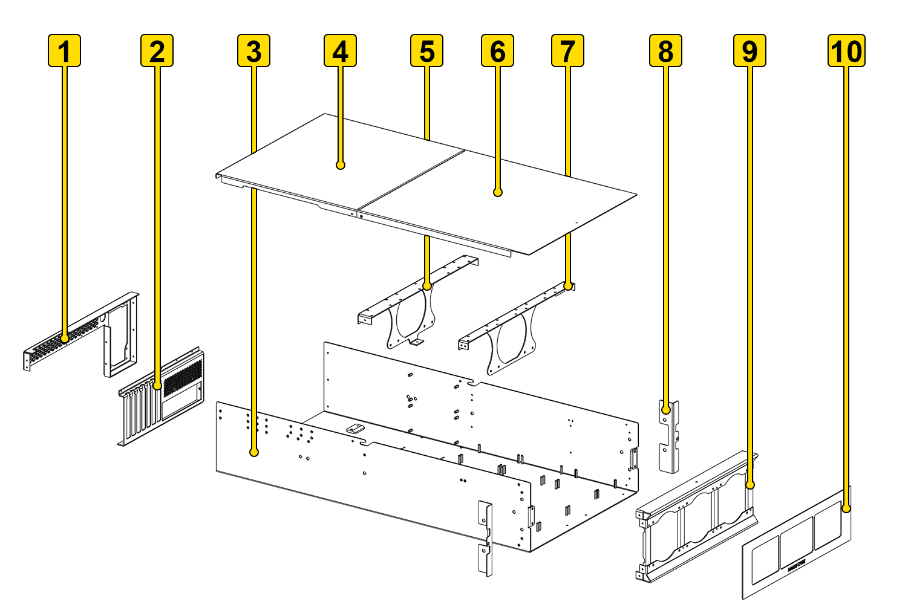
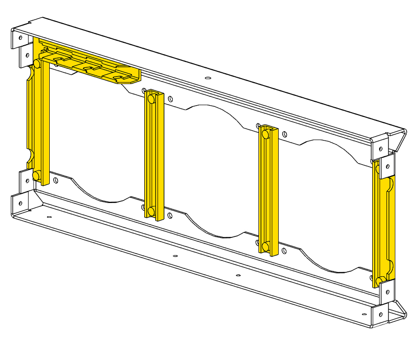
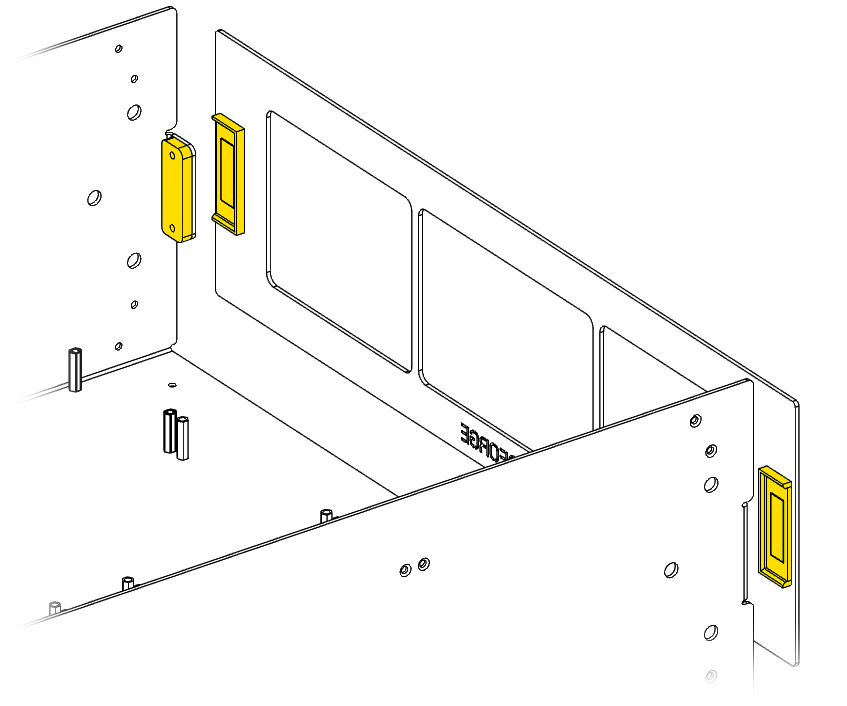
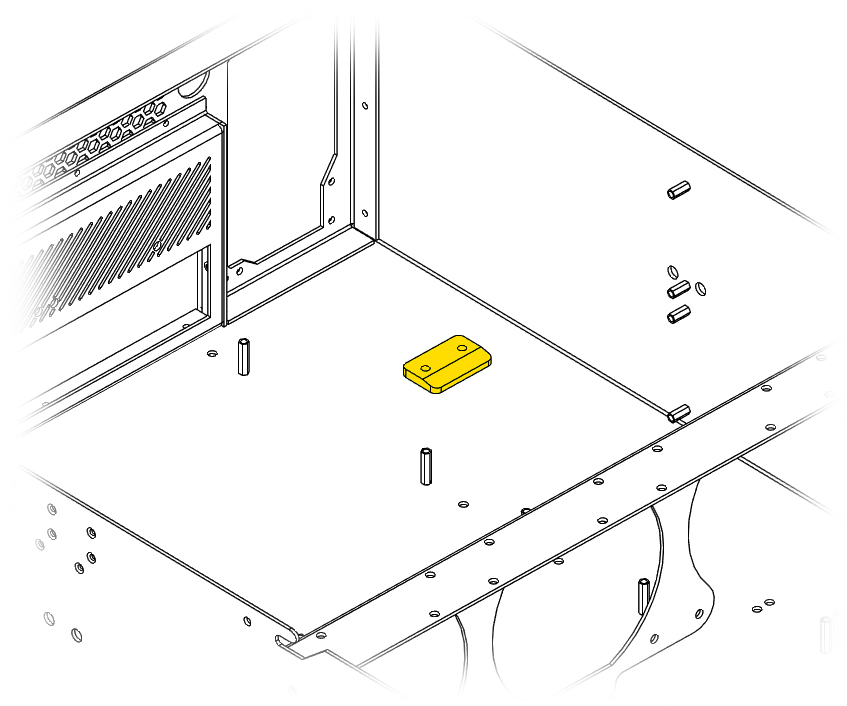

# Exploded View

Here is an exploded view of the chassis. This is useful if you're using our open source files to assemble your own Hako-Core.

## Component Identification

The Hako-Core Server Chassis consists of 10 main components that assemble together to form the complete chassis system.

### Primary Components

| Item | Component Name | Function | Assembly Notes |
|------|---------------|----------|----------------|
| **1** | PSU Bracket | Mounts PSU and power button | Supports up to 210mm PSU |
| **2** | PCIe I/O Bracket | Motherboard I/O support | Aligns with motherboard rear panel |
| **3** | Chassis Body | Main structure housing | Contains all internal components |
| **4** | Chassis Rear Lid | Easy access to hardware | Held in by 3 screws |
| **5** | Rear Fan Bracket | Supports rear drive cages | Also supports rear fans |
| **6** | Chassis Front Lid | Easy access to drives | Slide and lift with 1 screw |
| **7** | Middle Fan Bracket | Supports middle drive cages | Also supports rear fans |
| **8** | Rack Ears | Secures chassis in server rack | Both left and right of chassis |
| **9** | Front Fan Bracket | Front fan mounting | Also consists of 3D printed parts |
| **10** | Face Plate | Magnetic dust mesh | Held to chassis by magnets |

!!! note "Hako-Core Mini"
    The Hako-Core Mini does **not** have dual lids or a rear fan Bracket

### 3D Printed Components

There are various 3D printed parts included with the assembly of the Hako-Core.

#### Front Fan Mount Air Blocks.

These air blocks help the case facilitate proper front to back air flow.
There is an integrated fan connector holder for the front fans. The side blocks are different than the middle blocks.

#### Magnet Holders

These parts hold a magnet to allow the face plate to attach. The holder attached to the chassis is attached using screws. The holder attached to the face plate is epoxied in.

#### PSU Support

This piece supports the PSU to help reduce strain on the chassis.