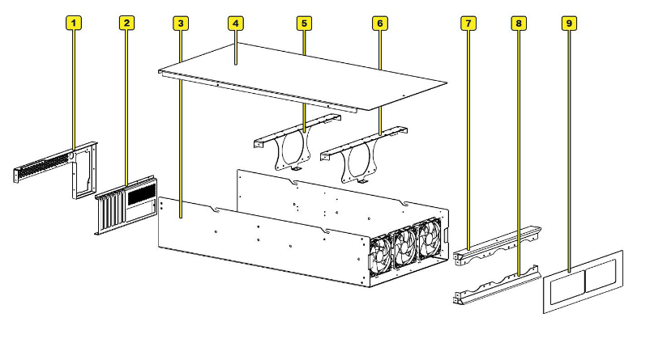

# Exploded View

Understanding the Hako-Core chassis components and their assembly relationships is crucial for proper installation and maintenance.

## Component Identification

The Hako-Core Server Chassis consists of 9 main components that assemble together to form the complete chassis system.

### Primary Components

| Item | Component Name | Function | Assembly Notes |
|------|---------------|----------|----------------|
| **1** | PSU Bracket | Mounts ATX power supply | Rear-mounted, supports up to 210mm PSU |
| **2** | PCIe I/O Bracket | Motherboard I/O support | Aligns with motherboard rear panel |
| **3** | Chassis Body | Main structure housing | Contains all internal components |
| **4** | Chassis Lid | Removable access panel | Slide-and-lift mechanism |
| **5** | Rear Cage Bracket | Supports rear drive cages | Modular mounting system |
| **6** | Front Cage Bracket | Supports middle drive cages | Optional fan mounting |
| **7** | Top Front Fan Bracket | Upper front fan mounting | Supports 3x 120mm fans |
| **8** | Bottom Front Fan Bracket | Lower front fan mounting | Intake configuration |
| **9** | Front Panel | Magnetic access panel | Tool-free removal |