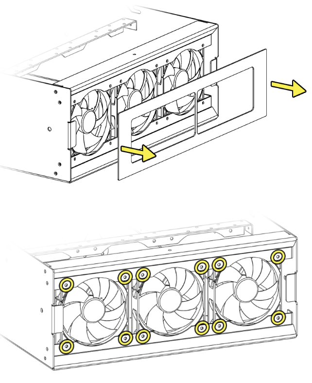
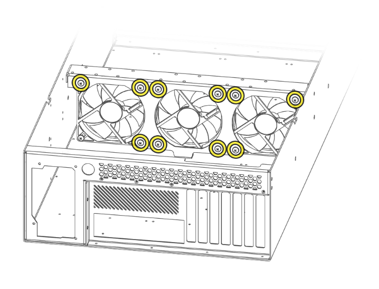

# Fan Installation

## Overview

### Key Features
- Hako-Core supports up to 9 fans
- Hako-Core Mini supports up to 6 fans

### Maximum Fan Configuration
#### Hako-Core

| Location | Included | Additional | Total |
|----------|----------|------------|-------|
| **Front Panel** | 3 fans | 0 fans | 3 fans |
| **Middle Cage Bracket** | 0 fans | +3 fans | 3 fans |
| **Rear Cage Bracket** | 0 fans | +3 fans | 3 fans |
| **Grand Total** | 3 fans | +6 fans | **9 fans** |

#### Hako-Core Mini

| Location | Included | Additional | Total |
|----------|----------|------------|-------|
| **Front Panel** | 3 fans | 0 fans | 3 fans |
| **Middle Cage Bracket** | 0 fans | +3 fans | 3 fans |
| **Rear Cage Bracket** | 0 fans | +3 fans | 3 fans |
| **Grand Total** | 3 fans | +6 fans | **9 fans** |

## Front Panel Fan Installation

### Installation Process

!!! important "Cage Removal Required"
    There must be **no drive cages installed in the first row** to access fan mounting points.

1. Locate the magnetic attachment points on the front panel
2. Gently pull the panel away from the chassis - magnets will release
3. Use provided screws to secure the fans onto the mounting locations.
4. Connect fan power and control cables

## Rear and Middle Fan Installation

### Installation Process

!!! warning "Cage Clearance"
    There must be **no cages installed around the respective rows** for fan access. Remove cages before attempting fan installation.

1. Remove relevant drive cages from the target row
3. Mount fans in correct orientation (airflow pointing out the back of the chassis)  
4. Secure with provided screws
5. Connect fan power and control cables

## Power and Control Connections

### Fan Power Options

1. **Hako-Core Powerboard**
    - 4-pin fan outputs available
    - Powered by PCIe IN 1 rail
    - Up to 4 fans per powerboard

2. **Hako-Core Mini Powerboard**
    - 4-pin fan outputs available
    - Powered by PCIe IN 1 rail
    - Up to 4 fans per powerboard

3. **Dedicated Fan Controller**
    - External PWM controller
    - Advanced temperature-based control
    - Support for many fans