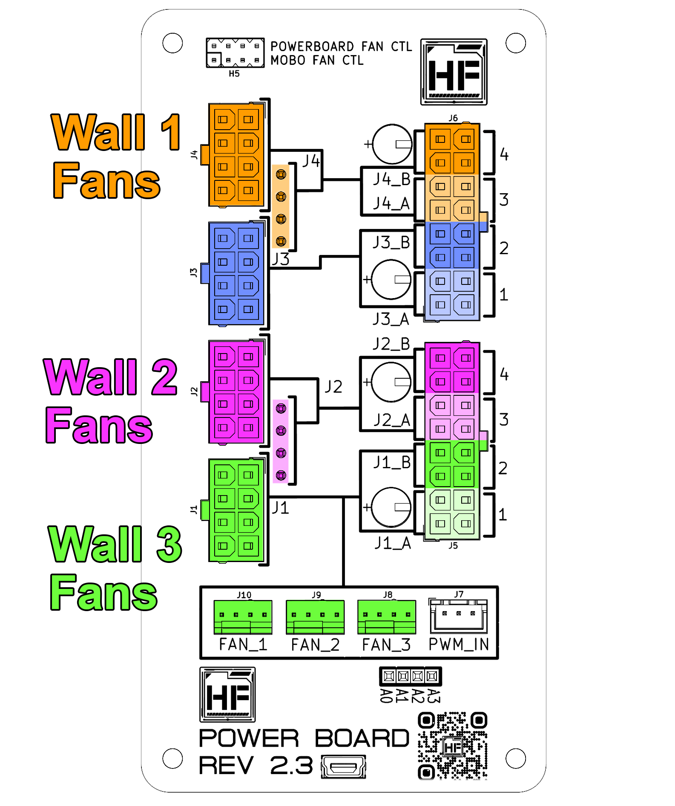

# Fan Installation

## Overview
!!! warning "Fan Thickness Compatibility"
    Only ***Fan Wall 1*** and ***Fan wall 3*** are capable of **35mm** thickness fans. ***Fan Wall 2*** is only able to fit **25mm** thickness fans.
!!! info "Fan Wall Compatibility"
    All fan walls use **120mm** fans.
### Hako-Core
- Hako-Core supports up to **3 fan walls totaling 9 fans total** (120mm)
- 1 Exhaust fan (80mm or 92mm)
- Auxiliary fans for PCIe cooling
### Hako-Core Mini
- Hako-Core Mini supports up to **2 fan walls totaling 6 fans total** (120mm)
- 1 Exhaust fan (80mm or 92mm)
- Auxiliary fans for PCIe cooling

## Installation Process
!!! danger "Safety First"
    It is always recommended to power down the system when working inside the case.

Check out the [Chassis Fans](../fans.md) page to see how the fans are installed and connected

## Powering Fans

{: style="width: 400px; height: auto;"}

The fans are powered by the 8-pin PCIe connections on the powerboard. 
Each 8-Pin PCIe connector powers a specific set of hardware. If there is a set of hardware that is not being used in your configuration, connection is optional. 
### 8-Pin PCIe IN 1
- Fan wall 1

### 8-Pin PCIe IN 3
- Fan wall 2

### 8-Pin PCIe IN 4
- Fan wall 3**

## Controlling Fans
Visit the [Powerboard Connections](../connections.md) page for more information on how the fans are controlled. 