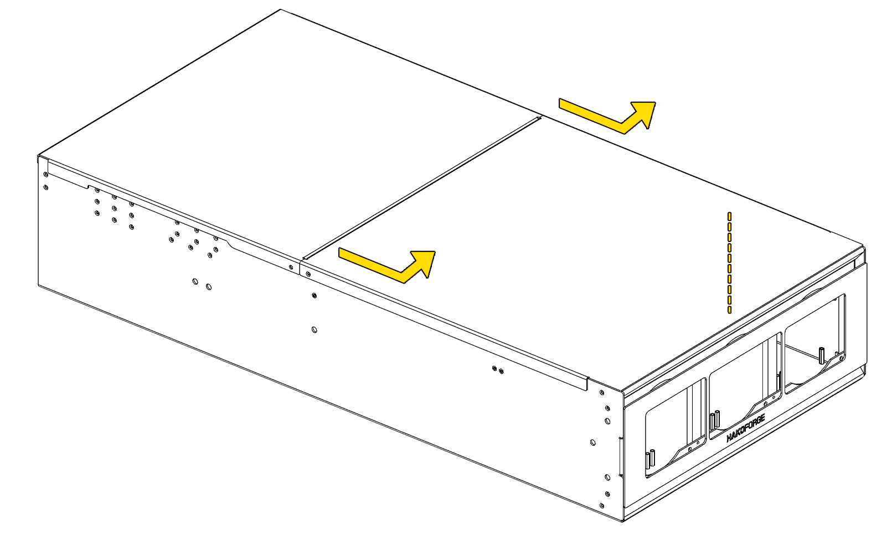
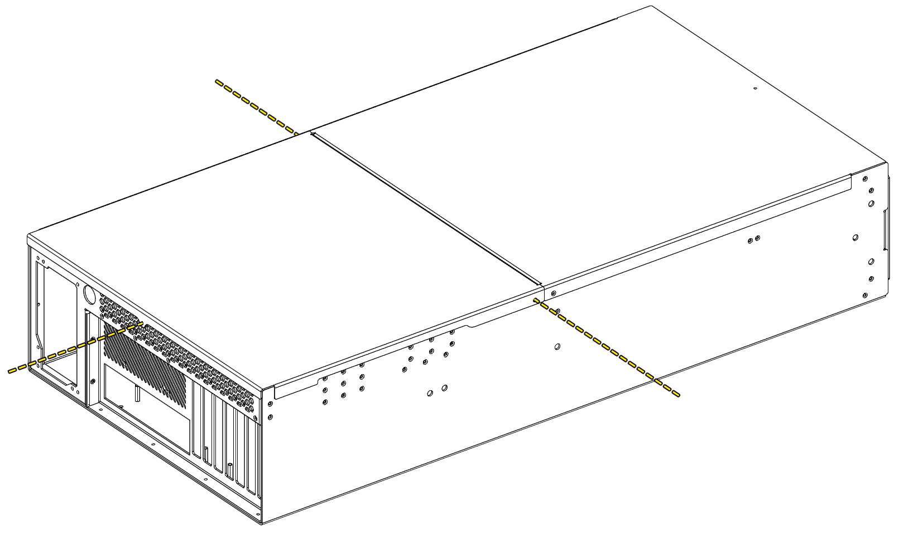

# Lid Removal

## Overview
The Hako-Core chassis lid is designed for quick removal while maintaining structural integrity when closed. The Hako-Core features a slide-and-lift lid mechanism for easy maintenance access.

!!! danger "Safety First"
    It is always recommended to power down the system when working inside the case.

!!! warning "Warning!"
    Check that no cables will be pinched or stressed during lid removal or installation.  
    Do not overtighten to avoid stripping the screw. There is 1 extra screw provided in the "extras bag".

## Removal Procedure

### Removing the Front Lid
!!! warning "Hako-Core Mini"
    The Hako-Core Mini only has one lid and will **slide towards the back.**

1. Locate the lid screw on the top front edge of the chassis.
2. Use a #2 Phillips head screwdriver to remove the screw.
2. Slide the lid towards the front of the case to unlatch.
3. Lift and remove the lid
### Removing the rear Lid

1. Locate the lid screws on the left and right side of the chassis and use a #2 Phillips head screwdriver to remove the screws.
2. Locate the thumb screw on the back of the chassis and use a #2 Phillips head screwdriver to remove the screw.
4. Lift and remove the lid.