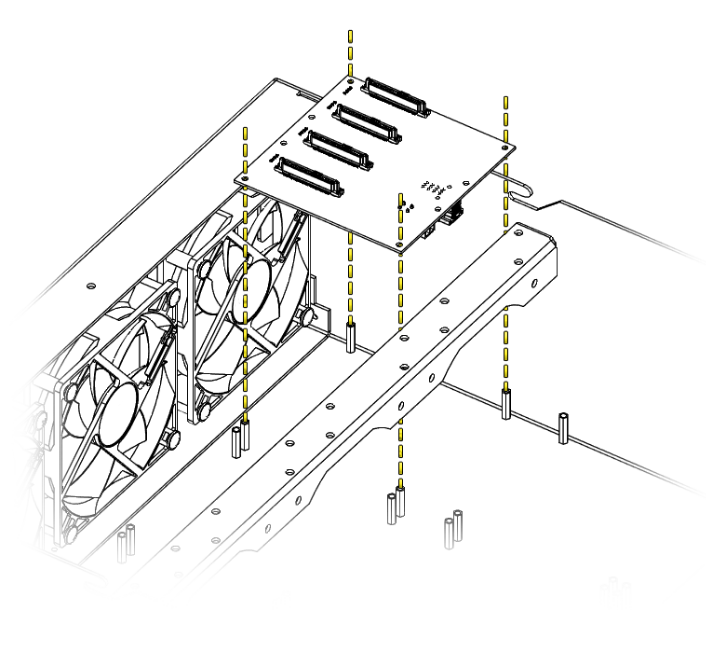

# PCB Installation

## Overview
This guide covers the proper mounting procedures for all backplane types and ensures secure connections.

Each PCB in the Hako-Core system provides power regulation and data connectivity for a specific set of drives. Proper installation ensures optimal performance and system reliability.

## PCB Types

The Hako-Core and Hako-Core Mini supports several PCB configurations:
###Standard Size Backplanes
- **4-HDD Backplane**: 3.5" drive support  
- **12-SSD Backplane**: 2.5" drive support
- **4-U.2 Backplane**: 2.5" drive support
###Small Size Backplanes
- **Mixed 4-Bay Backplane**: Combined 2.5" and 3.5" support

## Installation Procedure

!!! danger "Safety First"
    It is always recommended to power down the system when working inside the case.

### Identify Mounting Location

Each PCB has designated mounting locations within the chassis:

1. Locate standoffs in chassis for your PCB position
2. Align PCB over the mounting standoffs in correct orientation with connectors facing toward the rear of the case.
3. Verify all mounting holes align with standoffs
4. Secure PCB with provided screws. (Recommended to start opposite corners first)

!!! warning "Torque Specification"
    Be aware of cross threading when first turning the screw.  
    Do not over-tighten screws. PCBs can crack under excessive pressure.  
    Tighten just until snug with no movement.

## Verification Steps

### Visual Inspection

After installation, verify:

- PCB sits level and secure
- All screws properly tightened
- No visible cable stress or interference
- Any connectors are fully seated

### Electrical Testing

Before installing drives:

1. Power on system (without drives)
2. Check PCB power LEDs if present
4. Test with single drive before full installation