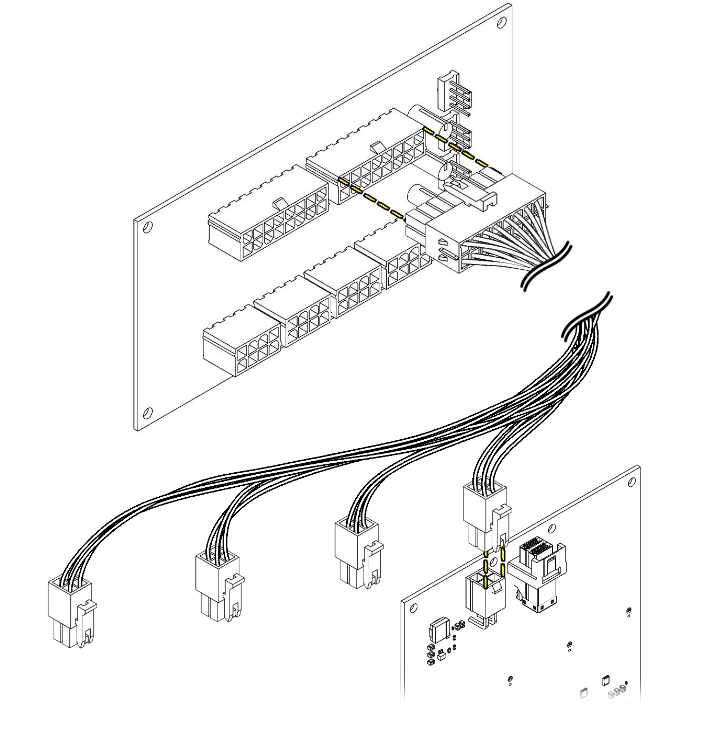

# Power Harness

## Overview

The Hako-Core power harness system distributes clean, regulated power from the central powerboard to individual PCBs throughout the chassis. This modular approach ensures efficient power delivery and simplified cable management.

The power harness acts as the distribution network between the central powerboard and the individual backplanes.

### Key Features

- Modular design with two harness lengths
- 16-pin to 4-pin distribution architecture  
- Overcurrent protection at the powerboard level

## Harness Specifications

### Technical Details

| Parameter | Specification |
|-----------|---------------|
| **Input Connector** | 16-pin keyed connector |
| **Output Connectors** | 4 x 4-pin power connectors |
| **Current Rating** | 150 watts per 8-pin PCIe |
| **Voltage** | 12V DC distribution |
| **Length Options** | Short (18") and Long (36") variants |

### Harness Variants

#### Short Harness (18" / .4cm)
- **Use case**: PCBs in first two rows from the front of the chasis
- **Quantity needed**: 1-8 per system

#### Long Harness (36" / 914mm)  
- **Use case**: PCBs in the 3rd and 4th rows from the front of the chasis
- **Quantity needed**: 1-8 per system

## Connection Architecture

### Power Distribution Flow

### Connector Pinout

#### 16-Pin Input Connector

| Pin | Function | Wire Color |
|-----|----------|------------|
| 1-4 | +12V Rail 1 | Red |
| 5-8 | Ground Rail 1 | Black |
| 9-12 | +12V Rail 2 | Red |
| 13-16 | Ground Rail 2 | Black |

#### 4-Pin Output Connectors

| Pin | Function | Wire Color |
|-----|----------|------------|
| 1 | +12V | Red |
| 2 | Ground | Black |
| 3 | +12V | Red |
| 4 | Ground | Black |

## Installation

!!! danger "Safety First"
    - Always power down before connecting/disconnecting harnesses
    - Verify proper connector orientation before seating
    - Never force connections - they should fit easily
    - Use proper ESD protection when handling

!!! tip "Cable Management Tips"
    - Route longer cables along outer chassis edges
    - Group harnesses by destination area
    - Use color coding for easy identification

### Step 1: Route Harnesses

1. Plan routing path from powerboard to each PCB
2. Use appropriate length harness for each connection
3. Route along chassis edges for longer runs (See Diagram Above)

### Step 2: Connect to Powerboard

2. Align 16-pin connector with powerboard output
3. Press firmly until connector fully seats
4. Verify secure connection with gentle pull test

### Step 3: Connect to PCBs

1. Install PCBs in their designated locations
2. Connect 4-pin outputs to appropriate PCB inputs
3. Press firmly until connector fully seats
4. Verify secure connection with gentle pull test