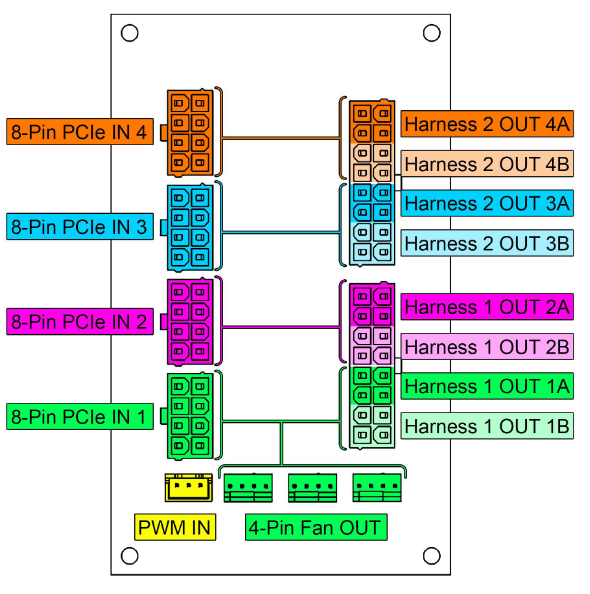

# Powerboard

## Overview
The powerboard is the central power distribution hub for the Hako-Core chassis. It takes 8-pin PCIe power inputs from your ATX power supply and distributes power throughout the Hako-Core power harnesses to individual PCBs.  

The powerboard provides clean, regulated power distribution for all storage devices and cooling systems in the Hako-Core chassis.

### Key Features

- **Input**: Multiple 8-pin PCIe power connectors from PSU
- **Output**: 24-pin connector to Hako-Core power harnesses
- **Fan Power**: Direct 4-pin fan power outputs
- **Modular Design**: Support for single or dual powerboard configuration

!!! important "Power Priority"
    **8-Pin PCIe IN 1** powers the 4-pin fan outputs. This input should be prioritized and connected first to ensure proper fan operation.

## **Installation**

### **Hako-Core**

!!! Note
    The Hako-Core can accept up to 2 powerboards for a maximum power delivery of 1200W total

**Before Mounting**: Ensure correct orientation of the board.

1. Mount the powerboard in designated area of chassis (see above image) onto standoffs with the 4 provided screws.

### **Hako-Core Mini**

!!! Note
    The Hako-Core Mini can only accept a single powerboard.

**Before Mounting**: Ensure correct orientation of the board.

1. Mount the powerboard in designated area of chassis (see above image) onto standoffs with the 4 provided screws.

## **Power Distribution Map**

### Input Connections

The powerboard accepts up to 4 x 8-pin PCIe power connectors:

| Connector | Purpose | Power Rail |
|-----------|---------|------------|
| **8-Pin PCIe IN 1** | Primary power + fan power | 12V rail |
| **8-Pin PCIe IN 2** | Additional power | 12V rail |
| **8-Pin PCIe IN 3** | Additional power | 12V rail |
| **8-Pin PCIe IN 4** | Additional power | 12V rail |

### Output Connections

#### Hako-Core Power Harness

Each 8-pin PCIe input corresponds to specific outputs on the 24-pin connector:

| Input | Output Harness | Color Code |
|-------|---------------|------------|
| PCIe IN 1 | Harness 1 OUT 1A & 1B | 🟢 Green |
| PCIe IN 2 | Harness 1 OUT 2A & 2B | 🟣 Purple |
| PCIe IN 3 | Harness 2 OUT 3A & 3B | 🔵 Blue |
| PCIe IN 4 | Harness 2 OUT 4A & 4B | 🟠 Orange |

#### Fan Power Outputs

- **4-Pin Fan OUT**: Direct fan power connections
- **Powered by**: 8-Pin PCIe IN 1
- **Control**: PWM speed control supported