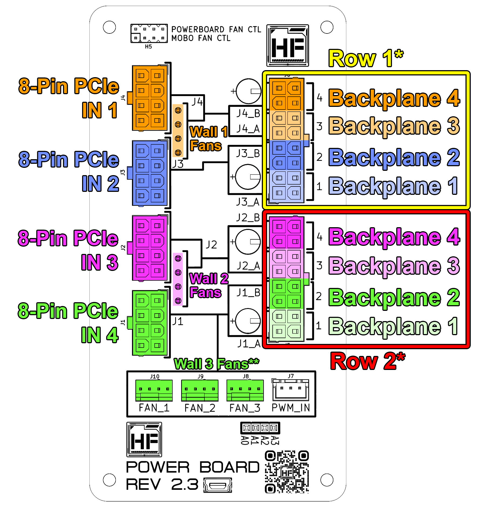

# Powerboard

## Overview
The powerboard is the central power distribution hub for the Hako-Core chassis. It takes 8-pin PCIe power inputs from your ATX power supply and distributes power throughout the Hako-Core power harnesses to individual PCBs.  

The powerboard provides clean, regulated power distribution for all storage devices and cooling systems in the Hako-Core chassis.

### Key Features

- **Input**: Multiple 8-pin PCIe power connectors from PSU
- **Output**: 24-pin connector to Hako-Core power harnesses
- **Fan Power**: Direct 4-pin fan power outputs
- **Modular Design**: Support for single or dual powerboard configuration

!!! important "Power Priority"
    **8-Pin PCIe IN 1** powers the 4-pin fan outputs. This input should be prioritized and connected first to ensure proper fan operation.

## **Installation**

### **Hako-Core**

!!! Note
    The Hako-Core can accept up to 2 powerboards for a maximum power delivery of 1200W total

**Before Mounting**: Ensure correct orientation of the board.

1. Mount the powerboard in designated area of chassis (see above image) onto standoffs with the 4 provided screws.

### **Hako-Core Mini**

!!! Note
    The Hako-Core Mini can only accept a single powerboard.

**Before Mounting**: Ensure correct orientation of the board.

1. Mount the powerboard in designated area of chassis (see above image) onto standoffs with the 4 provided screws.

## **Power Distribution Map**

### Input Connections
Each 8-Pin PCIe connector powers a specific set of hardware. If there is a set of hardware that is not being used in your configuration, connection is optional. 
### 8-Pin PCIe IN 1
- Row 1* Backplane 4
- Row 1* Backplane 3
- Fan wall 1

### 8-Pin PCIe IN 2
- Row 1* Backplane 2
- Row 1* Backplane 1

### 8-Pin PCIe IN 3
- Row 2* Backplane 4
- Row 2* Backplane 3
- Fan wall 2

### 8-Pin PCIe IN 4
- Row 2* Backplane 2
- Row 2* Backplane 1
- Fan wall 3**

!!! note "Dual Powerboard Hako-Core Configuration"
    \* ***Row 1*** and ***Row 2*** connections on the second powerboard are connected to ***Row 3*** and ***Row 4***   
    ** The exposed ***Fan Wall 3*** headers can be used for other fans if there is no fan wall 3 in your configuration

##Fan Control

Visit the [Connections](../connections.md) page to see how to configure the powerboard fan control features.