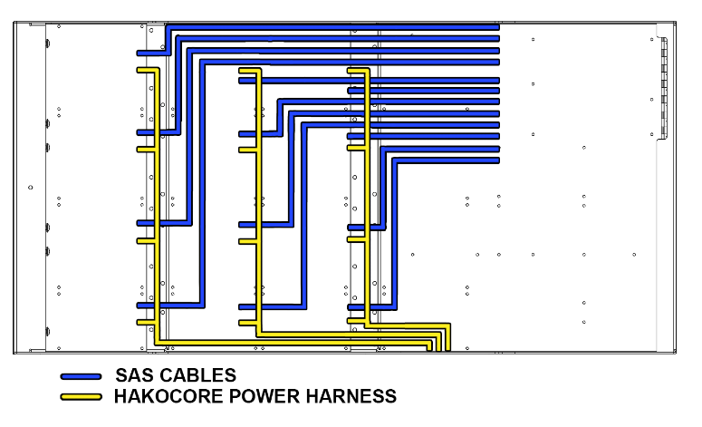

# Power Harness

## Overview

The Hako-Core power harness system distributes clean, regulated power from the central powerboard to individual PCBs throughout the chassis. This modular approach ensures efficient power delivery and simplified cable management.

The power harness acts as the distribution network between the central powerboard and the individual backplanes.

## SAS Cable Variants

### Short Harness (18" / .4cm)
- **Use case**: PCBs in first two rows from the front of the chasis
- **Quantity needed**: 1-8 per system

#### Medium Harness (18" / .6cm)
- **Use case**: PCBs in first two rows from the front of the chasis
- **Quantity needed**: 1-8 per system

### Long Harness (36" / .8cm)  
- **Use case**: PCBs in the 3rd and 4th rows from the front of the chasis
- **Quantity needed**: 1-8 per system

## Connection Diagram

## Installation

!!! danger "Safety First"
    It is always recommended to power down the system when working inside the case.

### Installing SAS Cables

1. Plan route from PCB to Motherboard
2. Use appropriate length SAS cables for each connection
3. Route along chassis edges for longer runs (See Diagram Above)
4. Connect SAS cables to PCBs and ensure each cable is snug with a gentle pull test