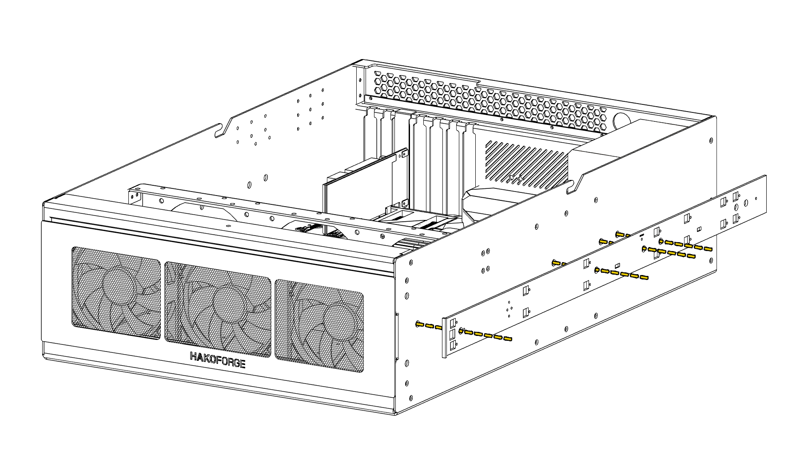
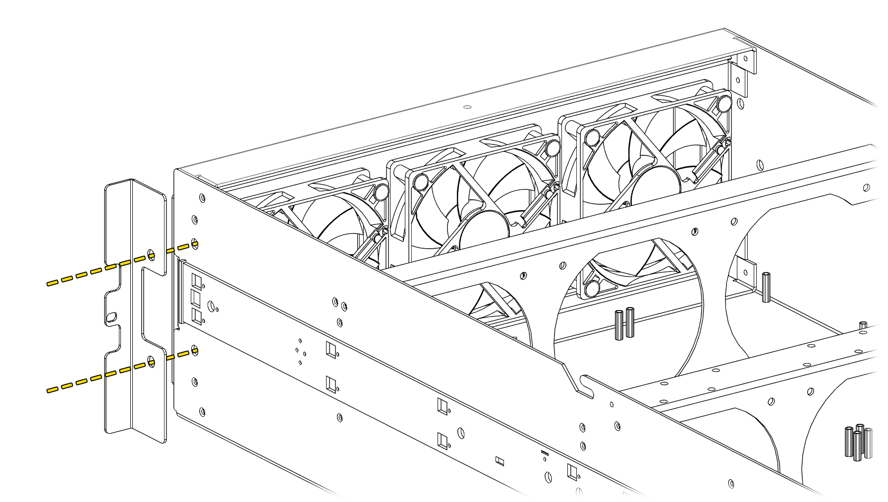

# Chassis Accessories
## Server Rails

!!! info "Left and Right Rails"
    Take note of the ***L*** and ***R*** stickers on the rails and mount them on the correct side.
!!! warning "Inner Server Rail Mounting Holes"
    When installing the inner server rails, use the screw holes shown in the diagram. Not all holes in the server rail are used. 
!!! info "Front of the Case"
    The front of the case is the end with the fan faceplate and drive cages. Orient the rails so their front end faces this side so the chassis slides into the rack correctly.

## Server Rack Ears

These rack ears are used to secure the Hako-Core to a server rack's frame.

!!! info "Left and Right Server Rack Ears"
    Rack ears will be labeled with a left and right sticker to distinguish.

!!! warning "Supporting The Chassis In A Server Rack"
    The rack ears alone are **not enough** to hold the chassis in a server rack. Server rails must be used. Rack ears are only to prevent the chassis from sliding out of the rack.

## Chassis Feet

{: style="max-width: 480px; width: 100%;"}

Available to purchase are 4 feet that can be screwed onto the side of the case to have a standing configuration.