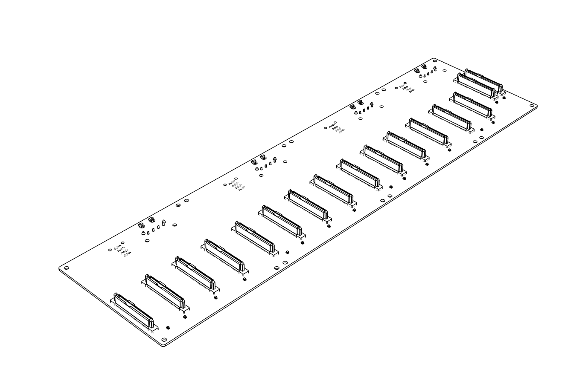
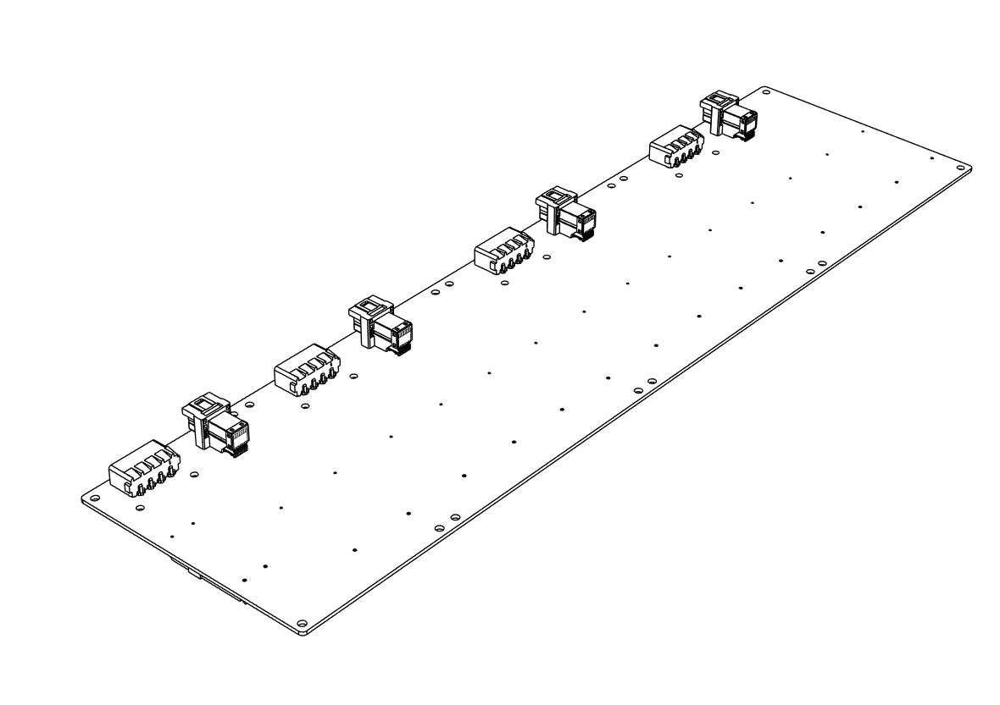
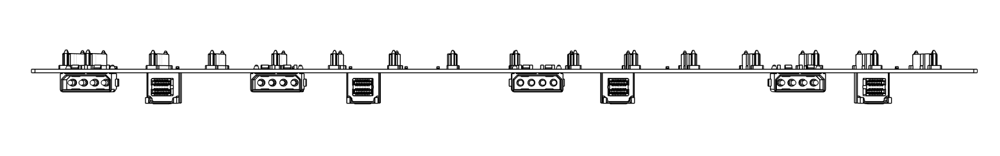
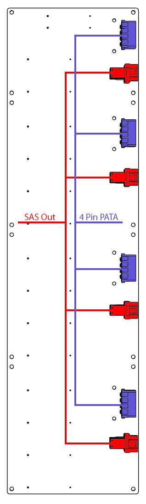
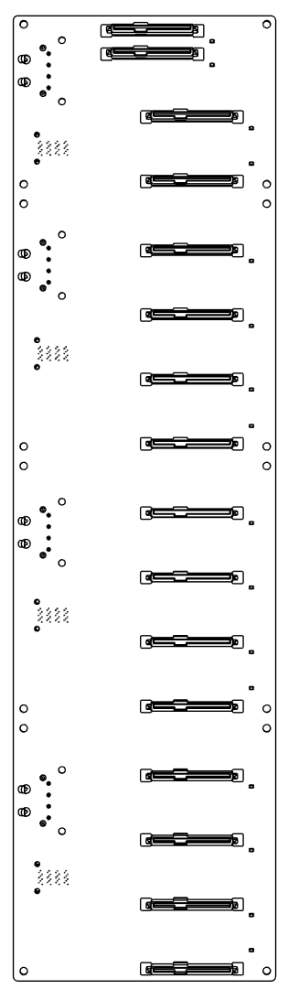

# HF-L1 Backplane

## Overview

<!-- TODO: fill in the backplane overview -->
The HF-L1 ships with 1 preinstalled backplane that provides power and data connectivity for the chassis drive bays. It is powered directly from the PSU via 4 PATA power cables (no power board required).

### Key Features

<!-- TODO: confirm / fill in the key features -->
- Supports 14 &times; 3.5" + 2 &times; 2.5" drives, or 16 &times; 2.5" drives
- Powered directly from the PSU via 4 PATA power cables
- SAS connectivity for data
- Hot-swap capable

## Technical Specifications

| Parameter | Specification |
|-----------|---------------|
| **Drive Connectors** | 4 x SATA |
| **Drive Support** | 14 &times; 3.5" + 2 &times; 2.5", or 16 &times; 2.5" |
| **SAS Output** | 4 SAS Out Connector |
| **Input Power** | 4 &times; PATA from PSU |
| **Hot-Swap** | Yes |

## Backplane Diagram

{: style="max-width: 700px; width: 100%;"}

{: style="display: inline-block; width: 48%; vertical-align: top;"}
{: style="display: inline-block; width: 48%; vertical-align: top;"}

### Status Indicators

- Power LED — green when drive is powered
- Activity LED — flashing during I/O operations

## Installation Guide

For Drive Cage Installation see [Cage Installation](../hardware/cage-installation.md).

## Drive Installation

<!-- TODO: confirm drive installation steps -->
1. Insert drives gently into the drive cages.
2. Gently press each drive down until firmly seated.
3. Verify with LED indicators after system power-on.
