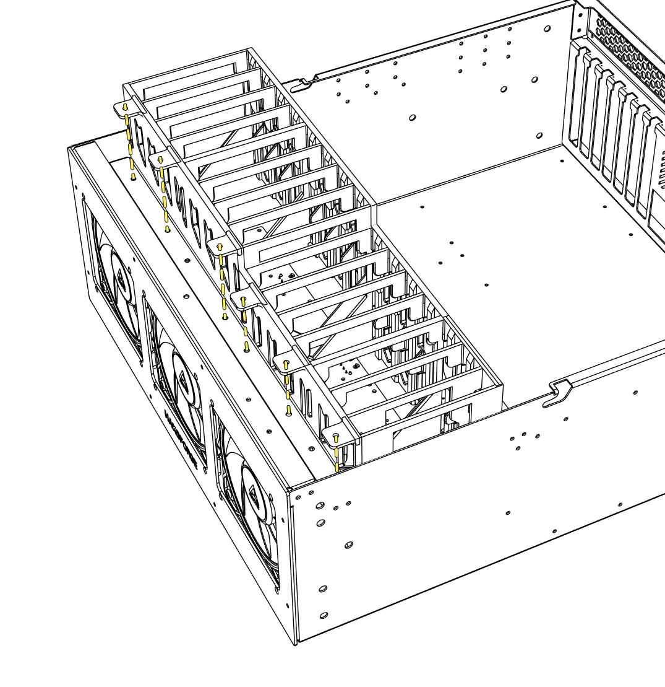

# Cage Installation

The HF-L1 comes preinstalled with 2 drive cages that are made specifically for this chassis. If you need to install a new one please follow the steps below.

!!! danger "Safety First"
    It is always recommended to power down the system when working inside the case.

1. Unscrew the thumbscrews holding the drive cage in.
2. Gently pull up on the drive cage to remove it from the chassis.
3. Slide the new cage back into place, ensuring that the cage sits flush on the PCB.
4. Screw in the thumbscrews to lock the cage in place.

!!! info "Cage Orientation"
    The 2 drive cages are different lengths, one long and one shorter. They only fit into the chassis in a specific orientation. The tabs on the cage that hold the thumbscrews will face towards the front of the chassis.
