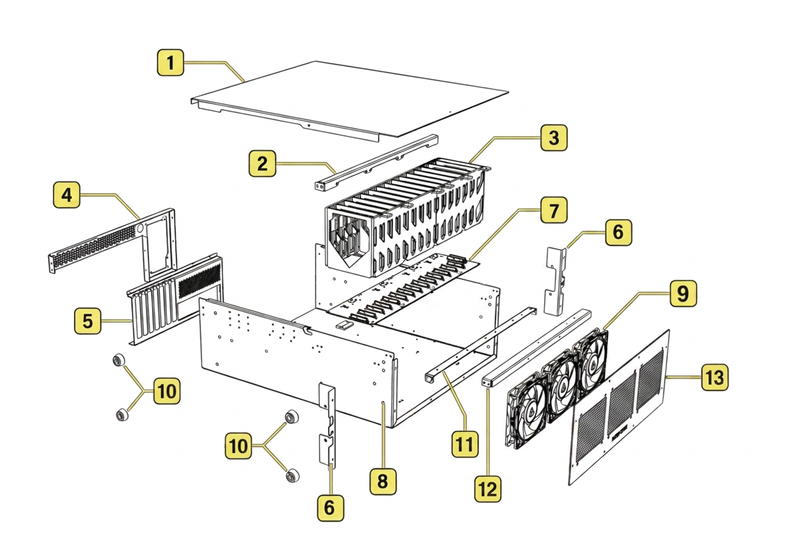

# Exploded View

Here is an exploded view of the chassis.

{: style="max-width: 700px; width: 100%;"}

## Component Identification

| Item | Component Name |
|------|----------------|
| **1** | Top Lid |
| **2** | AIO/Fan Bracket |
| **3** | Drive Cages |
| **4** | PSU Bracket |
| **5** | PCIE I/O Bracket |
| **6** | Rack Ears |
| **7** | Backplane |

| Item | Component Name |
|------|----------------|
| **8** | Chassis Body |
| **9** | Fan |
| **10** | Chassis Feet |
| **11** | Cage Bracket |
| **13** | Front Bracket |
| **14** | Faceplate |

