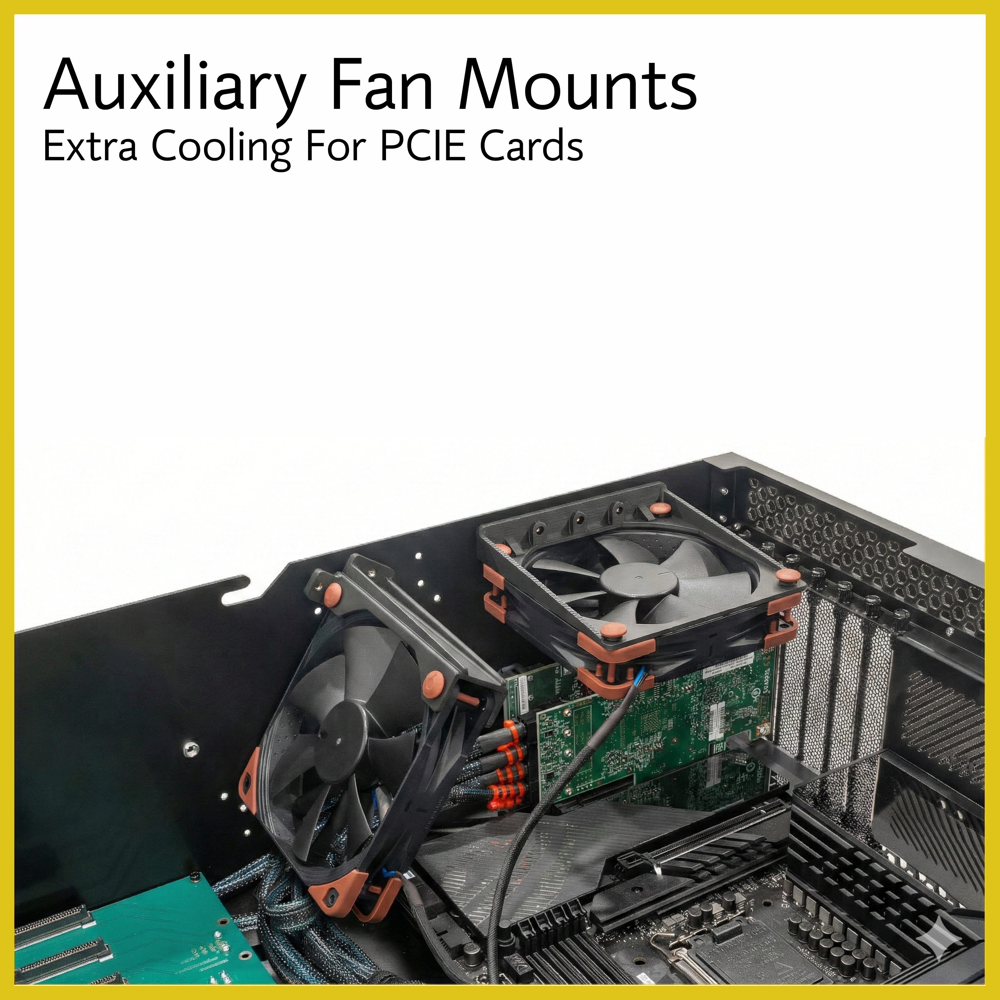
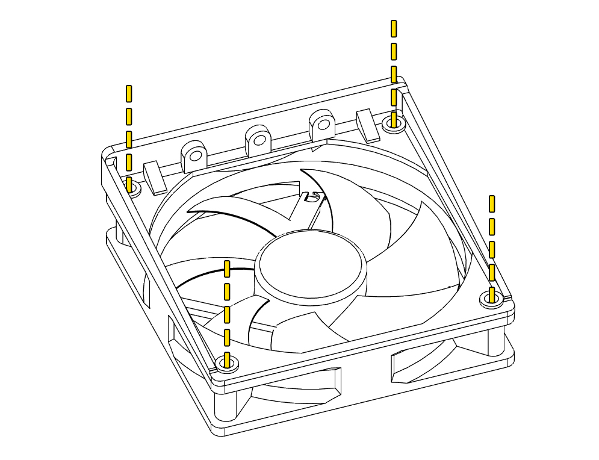
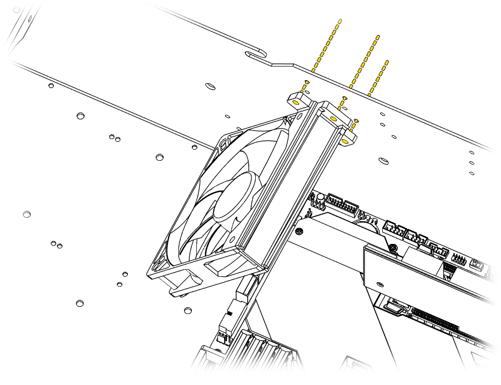
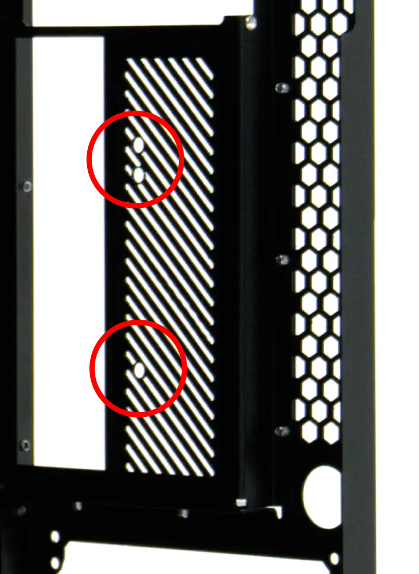

# Fan Installation

The HF-L1 comes **preinstalled with 3 fans on the front**. The power cables for these fans are routed underneath the preinstalled PCB.

## Overview
!!! info "Fan Sizing Compatibility"
    - Front fans use **120mm** fans.
    - Exhaust fan can be either **80mm or 92mm**
    - Angled and horizontal auxiliary fan brackets can be bought seperately and support **82mm, 90mm, or 120mm**.

- 6 Fans Total
    - **3 front fans** — 3x ARCTIC P12 Pro PST preinstalled; power cables routed underneath the preinstalled PCB
    - **1 rear exhaust fan** (80mm or 92mm) — **Not included**
    - **2 auxiliary fans** for PCIe cooling — 1 angled and 1 horizontal, brackets and fans sold seperately and support 82mm, 90mm, and 120mm fans.

Auxiliary fans can be mounted using one of our fan brackets:

- [Angled Fan Bracket](https://hakoforge.com/collections/accessories/products/angled-fan-bracket)
- [Horizontal 120mm Fan Bracket](https://hakoforge.com/collections/accessories/products/horrizontal-120mm-fan-bracket)

For the fans themselves, we recommend the ARCTIC P12 Pro PST

!!! note "Optional Power Board"
    A power board can be purchased separately for PWM fan control and usage of [HakoFoundry](../foundry.md).

## Installation Process
!!! danger "Safety First"
    It is always recommended to power down the system when working inside the case.

### Front Fan Wall

1. Disconnect the fan header cables that come preinstalled with the case.
2. Unscrew the face plate from the chassis.
3. Unscrew the fan your replacing from the face plate

Follow in reverse order to reassemble. 

It's advised to route the fan header cables underneath the PCB.

### Auxiliary Fans

1. Attach your fan to the bracket.
2. Screw the bracket into the desired mounting holes with provided hardware. (There are multiple to accomodate for larger PCIe cards)
3. Connect fan headers.

Auxiliary fans mount to one of two brackets, sold separately.

{: style="max-width: 700px; width: 100%;"}

#### Angled Fan Bracket

Use 2 of the mounting holes to secure a fan to the angled bracket.

#### Horizontal Fan Bracket

Use 4 of the mounting holes to secure a fan to the horizontal bracket.
!!! info "Direction of Air Flow"
    Take note of the fan mount direction to ensure proper air flow. Depending on the bracket orientation installed in the case, the fan may be flipped. 

##### Horizontal Overhang Mount

The mounting location can be moved left and right as well as up and down. 
!!! info "Left or Right Mount Points"
    When installing in the shifted left or right position, one of the mount points will not be used.

##### Angled Overhang Mount

The mounting location can be moved left and right as well as up and down. 
!!! info "Lower Mount Point"
    When installing in the lowered position, one of the mount points will not be used. 

##### Angled Underhang Mount

The angled fan bracket can also be under mounted. This can be useful depending on wire clearances with different HBA cards.

##### Mount Extension

The included mount extensions can be used to extend the bracket out for extra coverage on the furthest PCIe card. Use the extended screws for this configuration.

### Rear Exhaust Fan

With an 82mm or 90mm fan there are mounting holes on the back, angled exhaust port of the case that the fan can be mounted to. Shown below.

{: style="max-width: 700px; width: 100%;"}