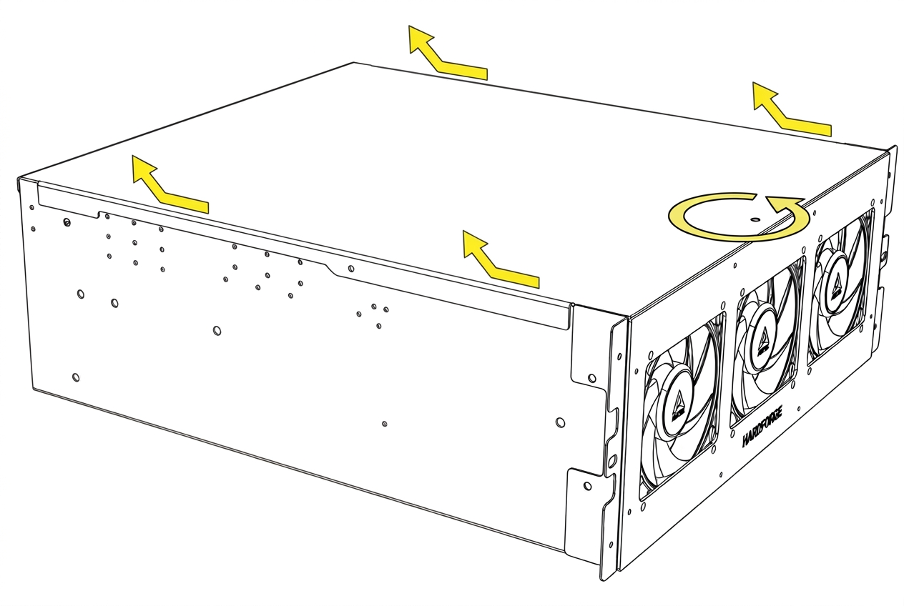

# Top Panel Removal

{: style="max-width: 480px; width: 100%;"}

!!! danger "Safety First"
    It is always recommended to disconnect power before doing any installation or maintenance when possible.

1. Remove the screw on the lid.
2. Slide the lid back, then lift up.
