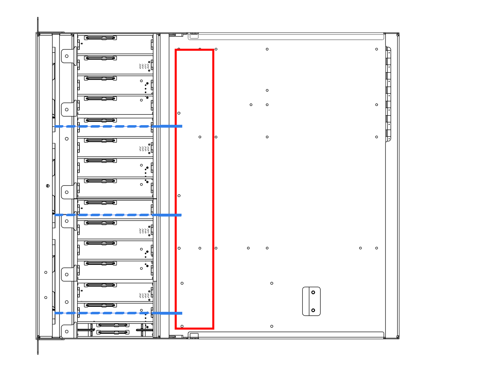

# Wire Routing

The HF-L1, when purchased, will come pre-assembled and cable managed. When managing cables yourself, we recommend the following practices.

{: style="max-width: 700px; width: 100%;"}

- Route power cables in the red center channel towards the bottom side of the case where the PSU is located (bottom right).
- The front fan cables come pre-routed underneath the PCB, as shown by the dotted blue line in the image above.
- When possible, route SAS cables away from power cables.
- Use zip-ties to secure cables when possible.
