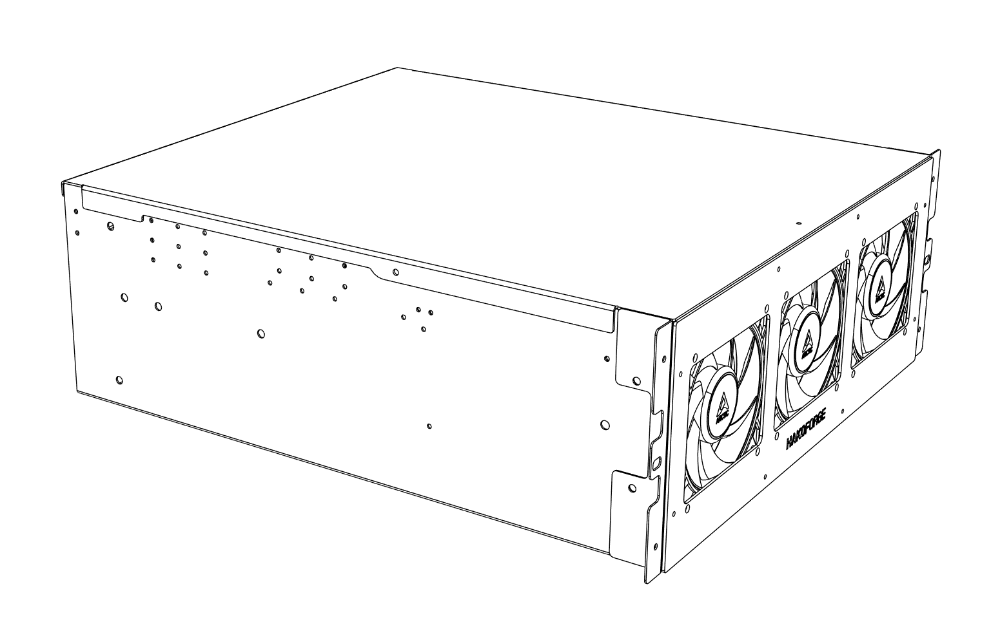
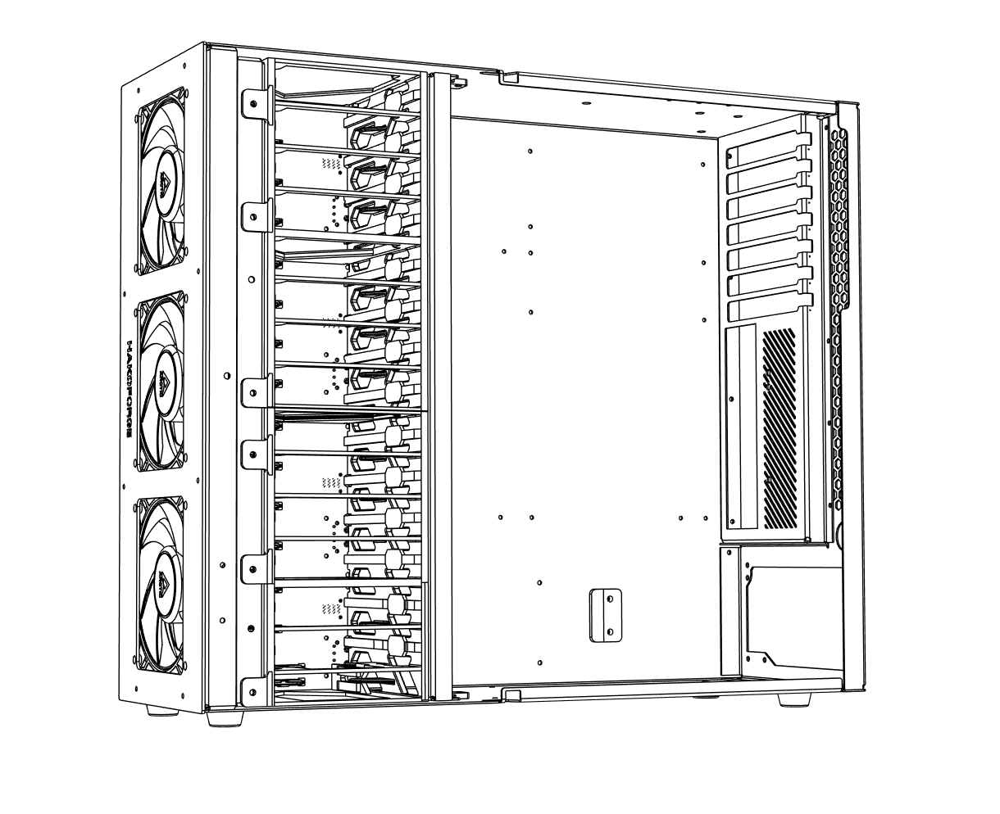

# HakoForge-Lite 1

Welcome to the official documentation for the HakoForge-Lite 1 (HF-L1) chassis. This guide will help you understand, install, and maintain your HF-L1 system.

## Quick Start

The HF-L1 comes pre-assembled and ready for use. Head over to the [Get Started](welcome.md) page for onboarding information, or check [Safety & Cautions](cautions.md) before doing any installation or maintenance.

## What is the HF-L1

The HakoForge-Lite 1 is a 4U server chassis designed as a streamlined, pre-assembled alternative to the Hako-Core line, with support for:

- **Pre-assembled**: Ships fully assembled and cable managed, ready for use out of the box
- **PATA-powered backplane**: 1 preinstalled backplane powered directly from the PSU via 4 PATA power cables (no power board required)
- **Multiple motherboard formats**: CEB, ATX, Micro ATX, and Mini-ITX
- **Cooling**: 3 included fans

## Getting Help

For questions, support, or warranty issues:

- **Email**: [help@hakoforge.com](mailto:help@hakoforge.com)
- **GitHub**: All documentation versions available on our [GitHub repository](https://github.com/hakoforge)
- **Warranty**: 90-day limited warranty included

---

*The HF-L1 will be an ongoing project. As new cages or PCBs are made, this manual may be updated or changed.*
