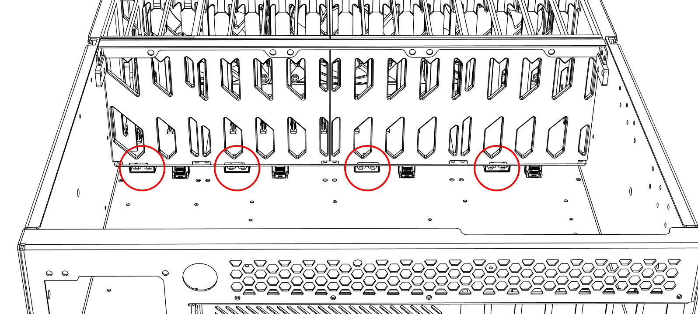

# Power

This chassis does not require a power board. Instead, it uses 4 PATA power cables directly from the PSU, connected to the backplane at the indicated areas below. 2 extension cables are included to help you.

{: style="max-width: 700px; width: 100%;"}

!!! note "Optional Power Board"
    A power board can be purchased separately for PWM fan control and usage of [HakoFoundry](foundry.md).
