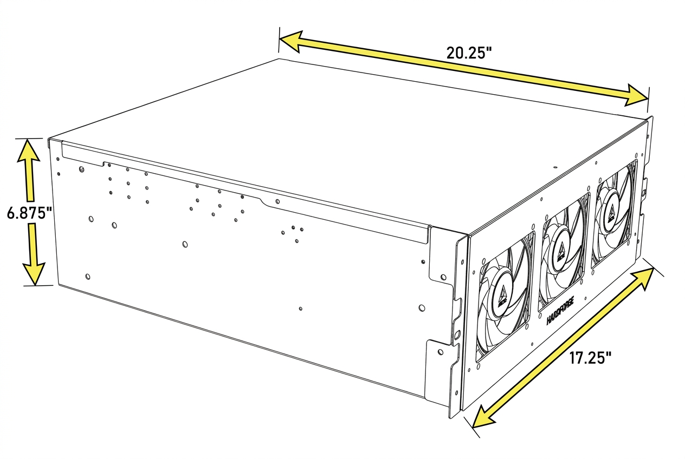

# Dimensions and Specifications

### Physical Dimensions

{: style="max-width: 700px; width: 100%;"}

| Specification | Value |
|----------------|-------|
| **Recommended PSU** | Corsair HX1000i |
| **GPU Clearance** | Length: ~320mm, Height: ~154mm |
| **CPU Cooler Clearance** | ~150mm &plusmn;5mm, depending on motherboard |
| **Form Factor** | 4U |
| **Weight** | 25 lbs (default configuration) |
| **Materials** | Powder coated steel |
| **Dimensions** | 20.25" x 17.25" x 6.875" |
| **Backplane** | 1 preinstalled backplane |
| **Drive Support** | 14 &times; 3.5" + 2 &times; 2.5", or 16 &times; 2.5" |
| **Motherboard Support** | CEB, ATX, Micro ATX, Mini-ITX |
| **PSU Support** | ATX, CRPS with adapter |
| **Fans** | 3 included fans, up to 9 |

