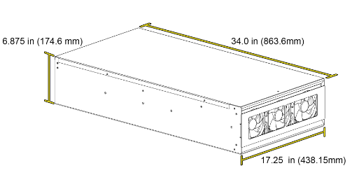

# Dimensions and Specifications

## Hako-Core Specifications

### Physical Dimensions

| Dimension | Measurement |
|-----------|-------------|
| **Length** | 34.0 in (863.6mm) |
| **Width** | 17.25 in (438.15mm) |
| **Height** | 6.875 in (174.6mm) |

### Storage Capacity

- **2.5" SSD/HDD**: Up to 36 drives (with 12-SSD backplanes)
- **3.5" HDD**: Up to 36 drives (with 4-HDD backplanes)
- **Mixed Configuration**: Combination of 2.5" and 3.5" drives

### Weight Specifications

| Configuration | Weight |
|---------------|--------|
| **Minimal Setup** | 20 lbs |
| *3 fans, 3 cages & PCBs, no drives* | |
| **Standard Setup** | 25 lbs |
| *3 fans, 9 cages & PCBs, no drives* | |
| **Fully Loaded** | ~35 to ~90 lbs |
| *3 fans, 9 cages & PCBs, 42 HDD, 6 SSD* | *(depending on drives used)* |

### Drive Power Capability

| Configuration | Power Output |
|---------------|--------------|
| **Single Powerboard** | 600 Watts |
| **Dual Powerboards** | 1,200 Watts |

### Motherboard Support

The Hako-Core supports a wide range of motherboard form factors:

- **Mini-ITX**
- **Micro ATX**
- **ATX**
- **EATX** (Extended ATX)

### Fan Support

| Location | Quantity | Notes |
|----------|----------|-------|
| **Included Fans** | 3 fans | Pre-installed in chassis |
| **Additional Front** | Up to 3 more | Requires removal of front drive cages |
| **Additional Rear/Middle** | Up to 6 more | Requires removal of respective drive cages |
| **Total Maximum** | 9 fans | With appropriate cage removal |

### Power Supply Support

- **Form Factor**: ATX standard
- **Maximum Length**: 200mm
- **Connector Requirements**: Standard ATX power connectors
- **Recommended Wattage**: 750W+ for full configuration

### Airflow Design

- **Front-to-rear** airflow pattern
- **Positive pressure** configuration recommended
- **Variable speed control** through motherboard or fan controller

### Materials

- **Construction**: Powder Coated Aluminum
- **Finish**: Durable powder coating for long-lasting protection
- **Mounting**: Standard rack-mountable 4U form factor

### Hot-Swap Support

- All drive bays support hot-swappable operation
- SAS/SATA compatibility across all bays
- Individual drive power and data connectivity

## Hako-Core Mini Specifications

### Physical Dimensions

| Dimension | Measurement |
|-----------|-------------|
| **Length** | 34.0 in (863.6mm) |
| **Width** | 17.25 in (438.15mm) |
| **Height** | 6.875 in (174.6mm) |

### Storage Capacity

- **2.5" SSD/HDD**: Up to 36 drives (with 12-SSD backplanes)
- **3.5" HDD**: Up to 36 drives (with 4-HDD backplanes)
- **Mixed Configuration**: Combination of 2.5" and 3.5" drives

### Weight Specifications

| Configuration | Weight |
|---------------|--------|
| **Minimal Setup** | 20 lbs |
| *3 fans, 3 cages & PCBs, no drives* | |
| **Standard Setup** | 25 lbs |
| *3 fans, 6 standard cages + 2 mini cages & PCBs, no drives* | |
| **Fully Loaded** | ~35 to ~90 lbs |
| *3 fans, 6 standard cages + 2 mini cages & PCBs, 42 HDD, 6 SSD* | *(depending on drives used)* |

### Power Capability

| Configuration | Power Output |
|---------------|--------------|
| **Single Powerboard** | 600 Watts |

### Motherboard Support

The Hako-Core Mini supports a wide range of motherboard form factors:

- **Mini-ITX**
- **Micro ATX**
- **ATX**
- **EATX** (Extended ATX)

### Fan Support

| Location | Quantity | Notes |
|----------|----------|-------|
| **Included Fans** | 3 fans | Pre-installed in chassis |
| **Additional Front** | Up to 3 more | Requires removal of front drive cages |
| **Additional Rear/Middle** | Up to 6 more | Requires removal of respective drive cages |
| **Total Maximum** | 9 fans | With appropriate cage removal |

### Power Supply Support

- **Form Factor**: ATX standard
- **Maximum Length**: 200mm
- **Connector Requirements**: Standard ATX power connectors
- **Recommended Wattage**: 750W+ for full configuration

### Airflow Design

- **Front-to-rear** airflow pattern
- **Positive pressure** configuration recommended
- **Variable speed control** through motherboard or fan controller

### Materials

- **Construction**: Powder Coated Aluminum
- **Finish**: Durable powder coating for long-lasting protection
- **Mounting**: Standard rack-mountable 4U form factor

### Hot-Swap Support

- All drive bays support hot-swappable operation
- SAS/SATA compatibility across all bays
- Individual drive power and data connectivity