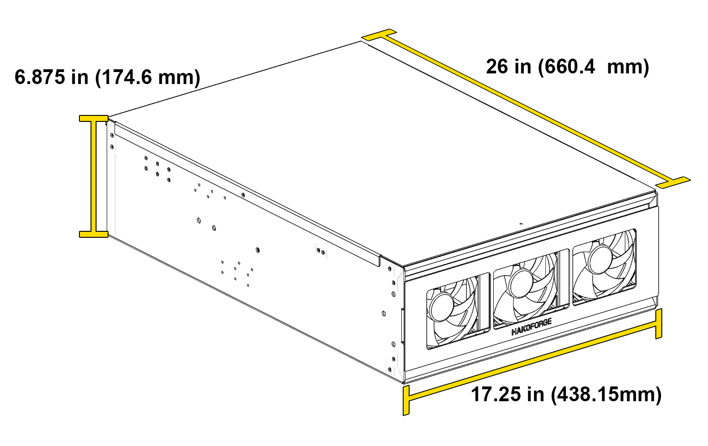

# Dimensions and Specifications

## Hako-Core Specifications

### Physical Dimensions

| Dimension | Measurement |
|-----------|-------------|
| **Length** | 34.0 in (863.6mm) |
| **Width** | 17.25 in (438.15mm) |
| **Height** | 6.875 in (174.6mm) |

### Weight Specifications

| Configuration | Weight |
|---------------|--------|
| **Minimal Setup** | 20 lbs |
| *3 fans, 3 cages & PCBs, no drives* | |
| **Standard Setup** | 25 lbs |
| *3 fans, 9 cages & PCBs, no drives* | |
| **Fully Loaded** | ~35 to ~90 lbs |
| *3 fans, 9 cages & PCBs, 42 HDD, 6 SSD* | *(depending on drives used)* |

### Drive Power Capability

The Hako-Core includes 2 powerboard which make it capable to power drives up to **1,200 Watts**.

### Motherboard Support

The Hako-Core supports a wide range of motherboard form factors:

- **Mini-ITX**
- **Micro ATX**
- **ATX**
- **E-ATX**

### Fan Support
!!! warning "Fan Thickness Compatibility"
    Only ***Fan Wall 1*** and ***Fan wall 3*** are capable of **35mm** thickness fans. ***Fan Wall 2*** is only able to fit **25mm** thickness fans.
- Hako-Core supports up to **3 fan walls totaling 9 fans total** (120mm)
- 1 Exhaust fan (80mm or 92mm)
- Auxiliary fans for PCIe cooling

### Power Supply Support

- **Form Factor**: ATX standard
- **Maximum Length**: 200mm
- **Connector Requirements**: Standard ATX power connectors

### Airflow Design

- **Front-to-rear** airflow pattern
- **Positive pressure** configuration recommended
- **Variable speed control** through motherboard or fan controller

### Materials

- **Construction**: Powder Coated Aluminum
- **Finish**: Durable powder coating for long-lasting protection
- **Mounting**: Standard rack-mountable 4U form factor

### Hot-Swap Support

- All drive bays support hot-swappable operation **excluding U.2 backplane**
- SAS/SATA compatibility across all bays
- Individual drive power and data connectivity

## Hako-Core Mini Specifications

### Physical Dimensions

| Dimension | Measurement |
|-----------|-------------|
| **Length** | 26.0 in (660.4mm) |
| **Width** | 17.25 in (438.15mm) |
| **Height** | 6.875 in (174.6mm) |

### Weight Specifications

| Configuration | Weight |
|---------------|--------|
| **Minimal Setup** | 15 lbs |
| *3 fans, 3 cages & PCBs, no drives* | |
| **Standard Setup** | 20 lbs |
| *3 fans, 6 standard cages + 2 mini cages & PCBs, no drives* | |
| **Fully Loaded** | ~35 to ~75 lbs |
| *3 fans, 6 standard cages + 2 mini cages & PCBs, 28 HDD, 6 SSD* | *(depending on drives used)* |

### Power Capability

The Hako-Core includes 2 powerboard which make it capable to power drives up to **600 Watts**.

### Motherboard Support

The Hako-Core Mini supports a wide range of motherboard form factors:

- **Mini-ITX**
- **Micro ATX**
- **ATX**
- **EATX** (Extended ATX)

### Fan Support

- Hako-Core Mini supports up to **2 fan walls totaling 6 fans total** (120mm)
- 1 Exhaust fan (80mm or 92mm)
- Auxiliary fans for PCIe cooling

### Power Supply Support

- **Form Factor**: ATX standard
- **Maximum Length**: 200mm
- **Connector Requirements**: Standard ATX power connectors
- **Recommended Wattage**: 750W+ for full configuration

### Airflow Design

- **Front-to-rear** airflow pattern
- **Positive pressure** configuration recommended
- **Variable speed control** through motherboard or fan controller

### Materials

- **Construction**: Powder Coated Aluminum
- **Finish**: Durable powder coating for long-lasting protection
- **Mounting**: Standard rack-mountable 4U form factor

### Hot-Swap Support

- All drive bays support hot-swappable operation **excluding U.2 backplane**
- SAS/SATA compatibility across all bays
- Individual drive power and data connectivity